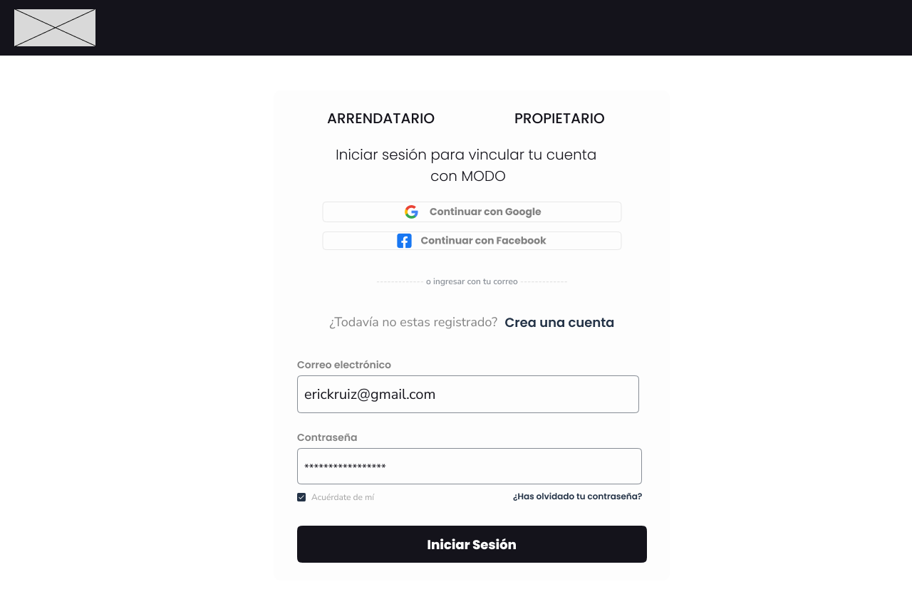
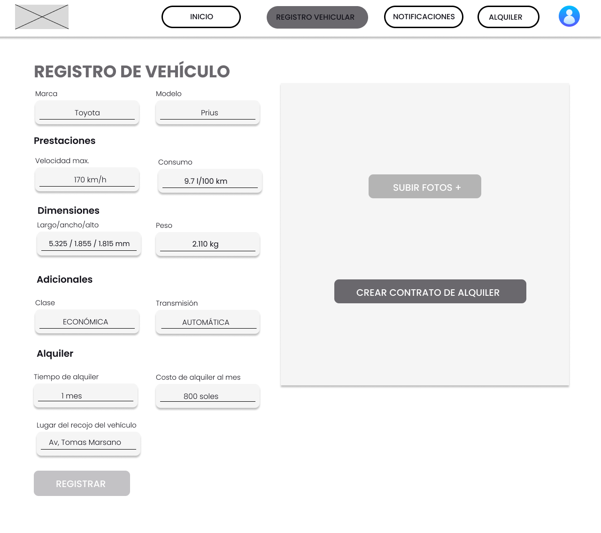
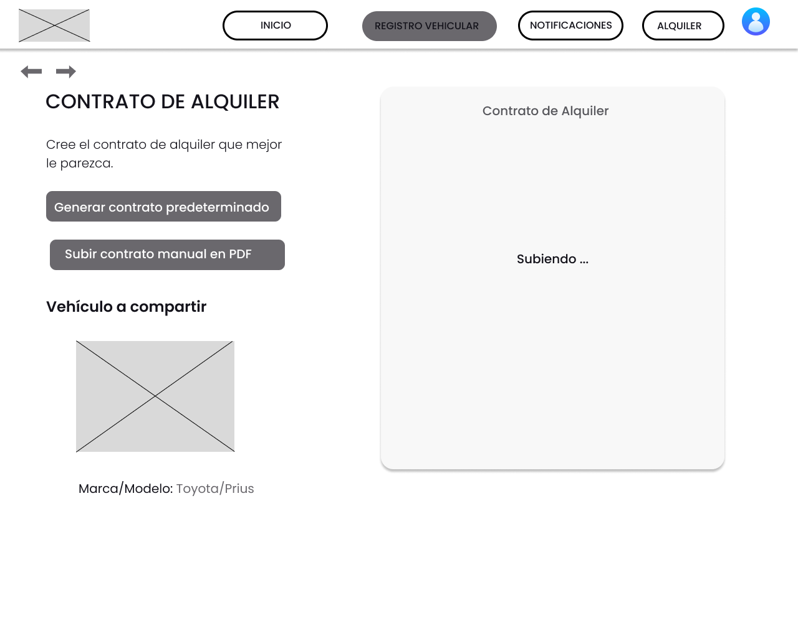
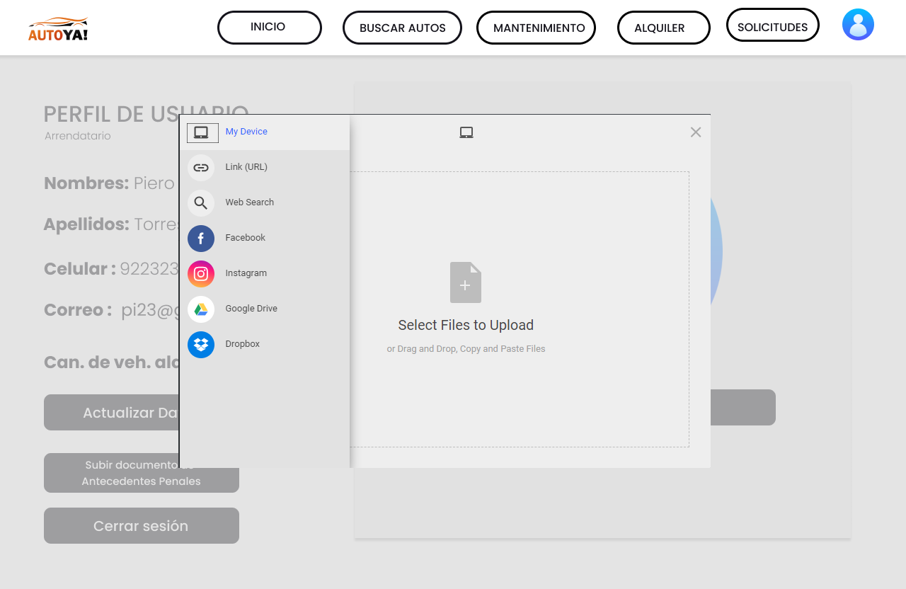
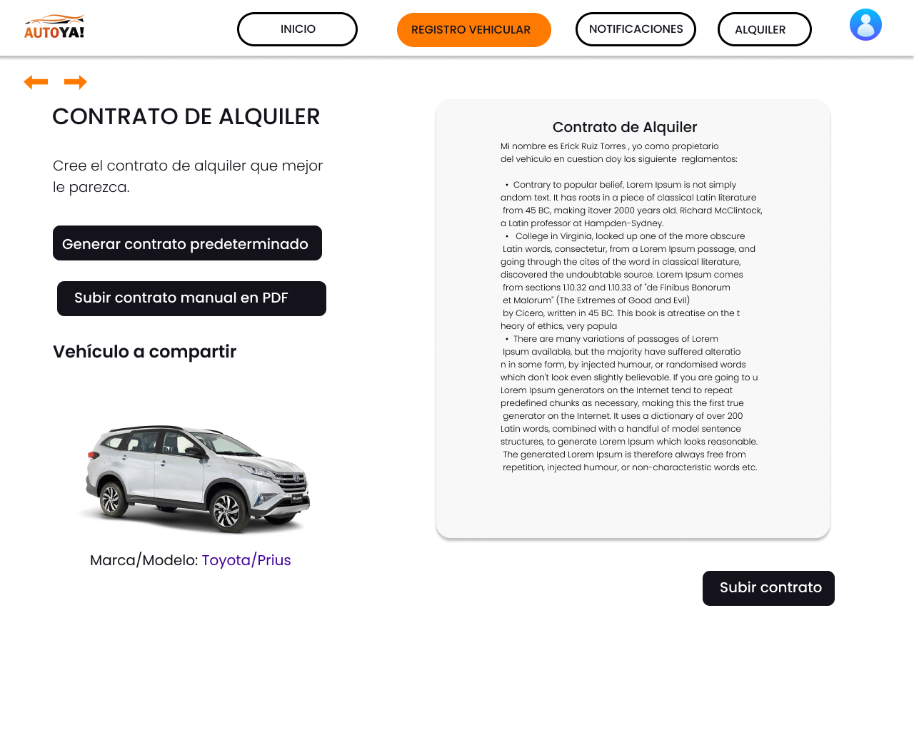
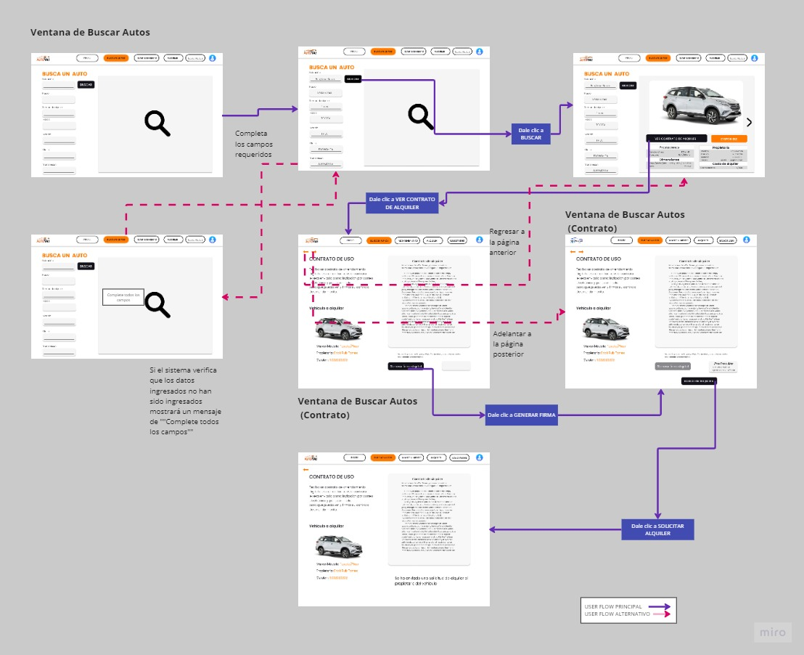

    
<h2>Universidad Peruana de Ciencias Aplicadas</h2>

<h2>Informe del Trabajo Final</h2>

<h3>Curso: Desarrollo de Aplicaciones Open Source</h3>
<h3>Carrera: Ingeniería de Software (5to ciclo)</h3>
<h3>Sección: SW54</h3>
<h3>Profesor: Hugo Allan Mori Paiva</h3>

<strong>Startup:</strong> TechVerse

<strong>Producto:</strong> AutoYa!

<h3>Integrantes:</h3>

<ul>
  <li>Erick Gabriel Urbizagastegui Alvarez U20201E465</li>
  <li>Erick Hernan Ruiz Torres U202118946</li>
  <li>Lynn Jeeferzon Meza Camayo U20201C320</li>
  <li>Samuel Rolando Chamorro Torres U202015096</li>
</ul>

**<h3>Agosto, 2023</h3>**

 
\pagebreak 

# Registro de Versiones del Informe

| Versión   | Fecha      | Autor | Descripción de modificación                                                                                                                                                                                                                                                                                                                                                                                                                                                                                                                                                                                                                                                                                                                                                                                                                                                                                                                                                                                                                                                                                                                                                                                                                                                                                                                                                                                                                                                                                                                                                                                                                                                                                                                                                                                                                                                                                                                                                                                                                                                                                                                                                                                                                                                                                                                                                                                                                                                                                                                                                                                                                                                                                                                                                                                                                                                     |
|-----------|------------|--------------|---------------------------------------------------------------------------------------------------------------------------------------------------------------------------------------------------------------------------------------------------------------------------------------------------------------------------------------------------------------------------------------------------------------------------------------------------------------------------------------------------------------------------------------------------------------------------------------------------------------------------------------------------------------------------------------------------------------------------------------------------------------------------------------------------------------------------------------------------------------------------------------------------------------------------------------------------------------------------------------------------------------------------------------------------------------------------------------------------------------------------------------------------------------------------------------------------------------------------------------------------------------------------------------------------------------------------------------------------------------------------------------------------------------------------------------------------------------------------------------------------------------------------------------------------------------------------------------------------------------------------------------------------------------------------------------------------------------------------------------------------------------------------------------------------------------------------------------------------------------------------------------------------------------------------------------------------------------------------------------------------------------------------------------------------------------------------------------------------------------------------------------------------------------------------------------------------------------------------------------------------------------------------------------------------------------------------------------------------------------------------------------------------------------------------------------------------------------------------------------------------------------------------------------------------------------------------------------------------------------------------------------------------------------------------------------------------------------------------------------------------------------------------------------------------------------------------------------------------------------------------------|
| Entrega 1 | 06-09-2023 | - Erick Gabriel Urbizagastegui Alvarez - Erick Hernan Ruiz Torres - Lynn Jeeferzon Meza Camayo - Samuel Rolando Chamorro Torres      | **Project Report Collaboration Insights**  **Contenido** Tabla de contenidos  **Student Outcome**  **Capitulo I:Introduccion** 1.1. Startup Profile 1.1.1. Descripción de la Startup 1.1.2. Perfiles de integrantes del equipo 1.2. Solution Profile 1.2.1 Antecedentes y problemática 1.2.2 Lean UX Process. 1.2.2.1. Lean UX Problem Statements. 1.2.2.2. Lean UX Assumptions. 1.2.2.3. Lean UX Hypothesis Statements. 1.2.2.4. Lean UX Canvas. 1.3. Segmentos objetivo.  **Capítulo II: Requirements Elicitation & Analysis** 2.1. Competidores. 2.1.1. Análisis competitivo. 2.1.2. Estrategias y tácticas frente a competidores. 2.2. Entrevistas. 2.2.1. Diseño de entrevistas. 2.2.2. Registro de entrevistas. 2.2.3. Análisis de entrevistas. 2.3. Needfinding. 2.3.1. User Personas. 2.3.2. User Task Matrix. 2.3.3. User Journey Mapping. 2.3.4. Empathy Mapping. 2.3.5. As-is Scenario Mapping.  **Capítulo III: Requirements Specification** 3.1. To-Be Scenario Mapping. 3.2. User Stories. 3.3. Impact Mapping. 3.4. Product Backlog.  **Capítulo IV: Product Design** 4.1. Style Guidelines. 4.1.1. General Style Guidelines. 4.1.2. Web Style Guidelines. 4.2. Information Architecture. 4.2.1. Organization Systems. 4.2.2. Labeling Systems. 4.2.3. SEO Tags and Meta Tags 4.2.4. Searching Systems. 4.2.5. Navigation Systems. 4.3. Landing Page UI Design. 4.3.1. Landing Page Wireframe. 4.3.2. Landing Page Mock-up. 4.4. Web Applications UX/UI Design. 4.4.1. Web Applications Wireframes. 4.4.2. Web Applications Wireflow Diagrams. 4.4.2. Web Applications Mock-ups. 4.4.3. Web Applications User Flow Diagrams. 4.5. Web Applications Prototyping. 4.6. Domain-Driven Software Architecture. 4.6.1. Software Architecture Context Diagram. 4.6.2. Software Architecture Container Diagrams. 4.6.3. Software Architecture Components Diagrams. 4.7. Software Object-Oriented Design. 4.7.1. Class Diagrams. 4.7.2. Class Dictionary. 4.8. Database Design. 4.8.1. Database Diagram.  **Capítulo V: Product Implementation, Validation & Deployment.** 5.1. Software Configuration Management. 5.1.1. Software Development Environment Configuration. 5.1.2. Source Code Management. 5.1.3. Source Code Style Guide & Conventions. 5.1.4. Software Deployment Configuration. 5.2. Landing Page, Services & Applications Implementation. 5.2.1. Sprint 1 5.2.1.1. Sprint Planning 1. 5.2.1.2. Sprint Backlog 1. 5.2.1.3. Development Evidence for Sprint Review. 5.2.1.4. Testing Suite Evidence for Sprint Review. |
| Entrega 2 | 20-09-2023 | - Erick Gabriel Urbizagastegui Alvarez - Erick Hernan Ruiz Torres - Lynn Jeeferzon Meza Camayo - Samuel Rolando Chamorro Torres    | **Project Report Collaboration Insights**  Elaboración de los componentes Búsqueda de Auto y Mantenimiento para el arrendatario   Elaboración de los componentes Perfil para el arrendatario y el propietario, y Solicitudes para el arrendatario   Elaboración de los componentes Login para el arrendatario y el propietario, Registro para el arrendatario y el propietario, Notificaciones para el propietario e Inicio Principal para el arrendatario y el propietario   Elaboración de los componentes Registro Vehicular para el propietario y Alquiler para el propietario y arrendatario |
| Entrega 3 | 2-11-2023 | - Erick Gabriel Urbizagastegui Alvarez - Erick Hernan Ruiz Torres - Lynn Jeeferzon Meza Camayo - Samuel Rolando Chamorro Torres    | **Sprint 3**  Elaboración del backend Elaboración del login Creación de la estructura del proyecto Creación de entities Creación de value objects Creación de aggregates  |
| Entrega 4 | 21-11-2023 | - Erick Gabriel Urbizagastegui Alvarez - Erick Hernan Ruiz Torres - Samuel Rolando Chamorro Torres  | **Sprint 4**  Finalización del backend Finalización del frontend Despliegue de la base de datos Despliegue del backend Despliegue del frontend Actulización del informe Grabación del video de exposición del TF1 |

 
\pagebreak 

# Project Report Collaboration Insights

## URL del repositorio del Project Report
[https://github.com/Grupo-2-Open-Source/Informe_de_trabajo](https://github.com/Grupo-2-Open-Source/Informe_de_trabajo)
## Insights

**TB1**

Para la elaboración del informe se utilizó un documento Markdown, el cual fue editado por todos los integrantes del equipo. Cada integrante primero hacía sus modificaciones en su respectiva rama en el repositorio para luego hacer un merge de su rama con la rama main. De esta forma nos aseguramos de que los avances de todos estuvieran incluidos en el informe final y que todos participaran.

 
\pagebreak 

# Contenido

- [Registro de Versiones del Informe](#registro-de-versiones-del-informe)
- [Project Report Collaboration Insights](#project-report-collaboration-insights)
  - [URL del repositorio del Project Report](#url-del-repositorio-del-project-report)
  - [Insights](#insights)
- [Contenido](#contenido)
- [Student Outcome](#student-outcome)
- [Capítulo I: Introducción](#capítulo-i-introducción)
  - [Startup Profile](#startup-profile)
    - [Descripción de la Startup](#descripción-de-la-startup)
    - [Perfiles de integrantes del equipo](#perfiles-de-integrantes-del-equipo)
  - [Solution Profile](#solution-profile)
    - [Antecedentes y problemática](#antecedentes-y-problemática)
    - [Lean UX Process](#lean-ux-process)
      - [Lean UX Problem Statements](#lean-ux-problem-statements)
      - [Lean UX Assumptions](#lean-ux-assumptions)
      - [Lean UX Hypothesis Statements](#lean-ux-hypothesis-statements)
      - [Lean UX Canvas](#lean-ux-canvas)
  - [Segmentos objetivo](#segmentos-objetivo)
- [Capítulo II: Requirements Elicitation \& Analysis](#capítulo-ii-requirements-elicitation--analysis)
  - [Competidores](#competidores)
    - [Análisis competitivo](#análisis-competitivo)
    - [Estrategias y tácticas frente a competidores](#estrategias-y-tácticas-frente-a-competidores)
  - [Entrevistas](#entrevistas)
    - [Diseño de entrevistas](#diseño-de-entrevistas)
    - [Registro de entrevistas](#registro-de-entrevistas)
    - [Análisis de entrevistas](#análisis-de-entrevistas)
  - [Needfinding](#needfinding)
    - [User Personas](#user-personas)
    - [User Task Matrix](#user-task-matrix)
    - [User Journey Mapping](#user-journey-mapping)
    - [Empathy Mapping](#empathy-mapping)
    - [As-is Scenario Mapping](#as-is-scenario-mapping)
- [Capítulo III: Requirements Specification](#capítulo-iii-requirements-specification)
  - [To-Be Scenario Mapping](#to-be-scenario-mapping)
      - [**Usuario: Propietario**](#usuario-propietario)
      - [**Usuario: Arrendatario**](#usuario-arrendatario)
    - [User Stories](#user-stories)
    - [Impact Mapping](#impact-mapping)
    - [Product Backlog](#product-backlog)
- [Capítulo IV: Product Design](#capítulo-iv-product-design)
  - [Style Guidelines](#style-guidelines)
    - [General Style Guidelines](#general-style-guidelines)
    - [Web Style Guidelines](#web-style-guidelines)
  - [Information Architecture](#information-architecture)
    - [Organization Systems](#organization-systems)
    - [Labeling Systems](#labeling-systems)
    - [SEO Tags and Meta Tags](#seo-tags-and-meta-tags)
    - [Searching Systems](#searching-systems)
    - [Navigation Systems](#navigation-systems)
  - [Landing Page UI Design](#landing-page-ui-design)
    - [Landing Page Wireframe](#landing-page-wireframe)
    - [Landing Page Mock-up](#landing-page-mock-up)
  - [Web Applications UX/UI Design](#web-applications-uxui-design)
    - [Web Applications Wireframes](#web-applications-wireframes)
    - [Web Applications Wireflow Diagrams](#web-applications-wireflow-diagrams)
    - [Web Applications Mock-ups](#web-applications-mock-ups)
    - [Web Applications User Flow Diagrams](#web-applications-user-flow-diagrams)
  - [Web Applications Prototyping](#web-applications-prototyping)
    - [Desktop Prototyping](#desktop-prototyping)
  - [Domain-Driven Software Architecture](#domain-driven-software-architecture)
    - [Software Architecture Context Diagram](#software-architecture-context-diagram)
    - [Software Architecture Container Diagrams](#software-architecture-container-diagrams)
    - [Software Architecture Components Diagrams](#software-architecture-components-diagrams)
  - [Software Object-Oriented Design](#software-object-oriented-design)
    - [Class Diagrams](#class-diagrams)
    - [Class Dictionary](#class-dictionary)
  - [Database Design](#database-design)
    - [Database Diagram](#database-diagram)
- [Capítulo V: Product Implementation, Validation \& Deployment](#capítulo-v-product-implementation-validation--deployment)
  - [Software Configuration Management](#software-configuration-management)
    - [Software Development Environment Configuration](#software-development-environment-configuration)
    - [Source Code Management](#source-code-management)
    - [Source Code Style Guide \& Conventions](#source-code-style-guide--conventions)
    - [Software Deployment Configuration](#software-deployment-configuration)
  - [Landing Page, Services \& Applications Implementation](#landing-page-services--applications-implementation)
    - [Sprint 1](#sprint-1)
      - [Sprint Planning 1](#sprint-planning-1)
      - [Sprint Backlog 1](#sprint-backlog-1)
      - [Development Evidence for Sprint Review](#development-evidence-for-sprint-review)
      - [Testing Suite Evidence for Sprint Review](#testing-suite-evidence-for-sprint-review)
      - [Execution Evidence for Sprint Review](#execution-evidence-for-sprint-review)
      - [Services Documentation Evidence for Sprint Review](#services-documentation-evidence-for-sprint-review)
      - [Software Deployment Evidence for Sprint Review](#software-deployment-evidence-for-sprint-review)
      - [Team Collaboration Insights during Sprint](#team-collaboration-insights-during-sprint)
    - [Sprint 2](#sprint-2)
      - [Sprint Planning 2](#sprint-planning-2)
      - [Sprint Backlog 2](#sprint-backlog-2)
      - [Development Evidence for Sprint Review](#development-evidence-for-sprint-review-1)
      - [Testing Suite Evidence for Sprint Review](#testing-suite-evidence-for-sprint-review-1)
      - [Execution Evidence for Sprint Review](#execution-evidence-for-sprint-review-1)
      - [Services Documentation Evidence for Sprint Review](#services-documentation-evidence-for-sprint-review-1)
      - [Software Deployment Evidence for Sprint Review](#software-deployment-evidence-for-sprint-review-1)
      - [Team Collaboration Insights during Sprint](#team-collaboration-insights-during-sprint-1)
    - [Sprint 3](#sprint-3)
      - [Sprint Planning 3](#sprint-planning-3)
      - [Sprint Backlog 3](#sprint-backlog-3)
      - [Development Evidence for Sprint Review](#development-evidence-for-sprint-review-2)
      - [Testing Suite Evidence for Sprint Review](#testing-suite-evidence-for-sprint-review-2)
      - [Execution Evidence for Sprint Review](#execution-evidence-for-sprint-review-2)
      - [Services Documentation Evidence for Sprint Review](#services-documentation-evidence-for-sprint-review-2)
      - [Software Deployment Evidence for Sprint Review](#software-deployment-evidence-for-sprint-review-2)
      - [Team Collaboration Insights during Sprint](#team-collaboration-insights-during-sprint-2)
  - [Validation Interviews](#validation-interviews)
    - [Diseño de Entrevistas](#diseño-de-entrevistas-1)
    - [Registro de Entrevistas](#registro-de-entrevistas-1)
    - [Evaluaciones según heurísticas](#evaluaciones-según-heurísticas)
  - [Video About-the-Product](#video-about-the-product)
- [Conclusiones](#conclusiones)
  - [Conclusiones y recomendaciones](#conclusiones-y-recomendaciones)
  - [Video About-the-Team](#video-about-the-team)
- [Bibliografía](#bibliografía)
- [Anexos](#anexos)

# Student Outcome

| Criterio Específico | Acciones Realizadas | Conclusiones |
|---------------------|--------------------------------------------------------------------------------------------------------------------------------------------------------------------------------------------------------------------------------------------------------------------------------------------------------------------------------------------------------------------------------------------------------------------------------------------------------------------------------------------------------------------------------------------------------------------------------------------------------------------------------------------------------------------------------------------------------------------------------------------------------------------------------------------------------------------------------------------------------------------------------------------------------------------------------------------------------------------------------------------------------------------------------------------------------------------------------------------------------------------------------------------------------------------------------------------------------------------------------------------------------------------------------------------------------------------------------------------------------------------------------------------------------------------------------------------------------------------------------------------------------------------------------------------------------------------------------------------------------------------------------------------------------------------------------------------------------------------------------------------------------------------------------------------------------------------------------------------------------------------------------------------------------------------------------------------------------------------------------------------------------------------------------------------------------------------------------------------------------------------------------------------------------------------------------------------------------------------------------------------------------------------------------------------------------------------------------------------------------------------------------------------------------------------------------------------------------------------------------------------------------------------------------------------------------------------------------------------------------------------------------------------------------------------------------------------------------------|---------------------------------------------------------------------------------------------------------------------------------------------------------------------------------------------------------------------------------------------------------------------------------------------------------------------------------------------------------------------------------------------------------------------------------------------------------------------------------------------------------------------------------------------------------------------------------------------------------------------------------------------------------------------------------------------------------------------------------------------------------------------------------------------------------------------------------------------------------------------------------------|
| **Comunica oralmente sus ideas y/o resultados con objetividad a público de diferentes especialidades y niveles jerarquicos, en el marco del desarrollo de un proyecto en ingeniería.** | **Chamorro Torres, Samuel Rolando** **TB1** 1.1.2. Perfiles de integrantes del equipo 2.2.2. Registro de entrevistas. 4.1. Style Guidelines. 4.1.1. General Style Guidelines. 4.1.2. Web Style Guidelines. 4.2. Information Architecture. 4.2.1. Organization Systems. 4.2.2. Labeling Systems. 4.2.3. SEO Tags and Meta Tags 4.2.4. Searching Systems. 4.2.5. Navigation Systems. 4.3. Landing Page UI Design. 4.3.1. Landing Page Wireframe. 4.3.2. Landing Page Mock-up.  5.1. Software Configuration Management. 5.1.1. Software Development Environment Configuration. 5.1.2. Source Code Management  **TP** Elaboración de los componentes Búsqueda de Auto y Mantenimiento para el arrendatario **TB2** Diseño de entrevistas de validación  **TF1** Despliegue de la base de datos Actualización del informe   **Meza Camayo, Lynn Jefferson** **TB1** 1.1.2. Perfiles de integrantes del equipo 2.2.2. Registro de entrevistas. 2.2.3. Análisis de entrevistas. 3.1. To-Be Scenario Mapping. 3.2. User Stories. 3.3. Impact Mapping. 3.4. Product Backlog.  **TP** Elaboración de los componentes Perfil para el arrendatario y el propietario, y Solicitudes para el arrendatario **TB2** Registro de entrevistas de validación  **Ruiz Torres, Erick Hernan** **TB1** 1.1.2. Perfiles de integrantes del equipo 2.2.2. Registro de entrevistas. 2.2.3. Análisis de entrevistas. 4.4. Web Applications UX/UI Design. 4.4.1. Web Applications Wireframes. 4.4.2. Web Applications Wireflow Diagrams. 4.4.2. Web Applications Mock-ups. 4.4.3. Web Applications User Flow Diagrams. 4.5. Web Applications Prototyping.  **TP** Elaboración de los componentes Login para el arrendatario y el propietario, Registro para el arrendatario y el propietario, Notificaciones para el propietario e Inicio Principal para el arrendatario y el propietario **TB2** Elaboración del login para los usuarios  **TF1** Actualziación del backend Despliegue del backend **Urbizagástegui Alvarez, Erick Gabriel** **TB1** 1.1. Startup Profile 1.1.1. Descripción de la Startup 1.1.2. Perfiles de integrantes del equipo 1.2. Solution Profile 1.2.1 Antecedentes y problemática 1.2.2 Lean UX Process. 1.2.2.1. Lean UX Problem Statements. 1.2.2.2. Lean UX Assumptions. 1.2.2.3. Lean UX Hypothesis Statements. 1.2.2.4. Lean UX Canvas. 1.3. Segmentos objetivo. 2.1. Competidores. 2.1.1. Análisis competitivo. 2.1.2. Estrategias y tácticas frente a competidores. 2.2. Entrevistas. 2.2.1. Diseño de entrevistas. 2.2.2. Registro de entrevistas. 2.2.3. Análisis de entrevistas. 2.3. Needfinding. 2.3.1. User Personas. 2.3.2. User Task Matrix. 2.3.3. User Journey Mapping. 2.3.4. Empathy Mapping. 2.3.5. As-is Scenario Mapping.  **TP** Elaboración de los componentes Registro Vehicular para el propietario y Alquiler para el propietario y arrendatario **TB2** Implementación del fakeAPI en el frontend **TF1** Actualización del frontend Despliegue del frontend  | **TB1**  Se realizaron lo capítulos del I al IV, esto nos permitió entender el problema a aboradar; saber quiénes se ven afectados por este problema; crear user personas para este problema; proponer soluciones para este problema; y crear un Landing Page que muestre nuestra propuesta de solución al problema. Finalmente, se utilizó GitHub para organizar los avances de cada integrante.  **TP**  En la entrega de nuestro proyecto, se destacó la habilidad del grupo para comunicar de manera oral sus ideas y resultados con objetividad. Esta competencia fue evidente al presentar nuestros avances y soluciones a públicos de diferentes especialidades y niveles jerárquicos. La capacidad de comunicar de manera efectiva en un lenguaje claro y comprensible demuestra un alto grado de profesionalismo y habilidad en el campo de la ingeniería.  **TB2** Se empezó con el desarrollo del backend de nuestra aplicación, AutoYa!, de forma grupal. Asimismo, se mejoró el frontend incluyendo el uso de un fake API en este.  **TF1** Se desplegó el backend y frontend y se prob+o que funcionaran ambos componentes. Aprendimos a configurar correctamente el CORS para permitir que nuestra aplicación web pueda acceder a nuestra web API  |
| **Comunica en forma escrita ideas y/o resultados con objetividad a público de diferentes especialidades y niveles jerarquicos, en el marco del desarrollo de un proyecto en ingeniería.** | **Chamorro Torres, Samuel Rolando** **TB1** 1.1.2. Perfiles de integrantes del equipo 2.2.2. Registro de entrevistas. 4.1. Style Guidelines. 4.1.1. General Style Guidelines. 4.1.2. Web Style Guidelines. 4.2. Information Architecture. 4.2.1. Organization Systems. 4.2.2. Labeling Systems. 4.2.3. SEO Tags and Meta Tags 4.2.4. Searching Systems. 4.2.5. Navigation Systems. 4.3. Landing Page UI Design. 4.3.1. Landing Page Wireframe. 4.3.2. Landing Page Mock-up.  5.1. Software Configuration Management. 5.1.1. Software Development Environment Configuration. 5.1.2. Source Code Management **TP** Elaboración de los componentes Búsqueda de Auto y Mantenimiento para el arrendatario  **TB2** Diseño de entrevistas de validación  **TF1** Despliegue de la base de datos Actualización del informe **Meza Camayo, Lynn Jefferson** 1.1.2. Perfiles de integrantes del equipo 2.2.2. Registro de entrevistas. 2.2.3. Análisis de entrevistas. 3.1. To-Be Scenario Mapping. 3.2. User Stories. 3.3. Impact Mapping. 3.4. Product Backlog.  **TP** Elaboración de los componentes Perfil para el arrendatario y el propietario, y Solicitudes para el arrendatario **TB2** Registro de entrevistas de validación  **Ruiz Torres, Erick Hernan** 1.1.2. Perfiles de integrantes del equipo 2.2.2. Registro de entrevistas. 2.2.3. Análisis de entrevistas. 4.4. Web Applications UX/UI Design. 4.4.1. Web Applications Wireframes. 4.4.2. Web Applications Wireflow Diagrams. 4.4.2. Web Applications Mock-ups. 4.4.3. Web Applications User Flow Diagrams. 4.5. Web Applications Prototyping.  **TP** Elaboración de los componentes Login para el arrendatario y el propietario, Registro para el arrendatario y el propietario, Notificaciones para el propietario e Inicio Principal para el arrendatario y el propietario **TB2** Elaboración del login para los usuarios  **TF1** Actualziación del backend Despliegue del backend **Urbizagástegui Alvarez, Erick Gabriel** 1.1. Startup Profile 1.1.1. Descripción de la Startup 1.1.2. Perfiles de integrantes del equipo 1.2. Solution Profile 1.2.1 Antecedentes y problemática 1.2.2 Lean UX Process. 1.2.2.1. Lean UX Problem Statements. 1.2.2.2. Lean UX Assumptions. 1.2.2.3. Lean UX Hypothesis Statements. 1.2.2.4. Lean UX Canvas. 1.3. Segmentos objetivo. 2.1. Competidores. 2.1.1. Análisis competitivo. 2.1.2. Estrategias y tácticas frente a competidores. 2.2. Entrevistas. 2.2.1. Diseño de entrevistas. 2.2.2. Registro de entrevistas. 2.2.3. Análisis de entrevistas. 2.3. Needfinding. 2.3.1. User Personas. 2.3.2. User Task Matrix. 2.3.3. User Journey Mapping. 2.3.4. Empathy Mapping. 2.3.5. As-is Scenario Mapping.  **TP** Elaboración de los componentes Registro Vehicular para el propietario y Alquiler para el propietario y arrendatario **TB2** Implementación del fakeAPI en el frontend **TF1** Actualización del frontend Despliegue del frontend   | **TB1**  Identificar un problema y las personas a las que afecta nos permitió determinar segmentos objetivos en base a los cuales se realizaron entrevistas para su posterior análisis. Esto, a su vez, nos ayudo a recolectar datos para la creación de los User Persona, Empathy Maps, Impact Maps, As-Is Scenario Maps y To-Be Scenario Maps. Adicionalmente, haber creado un Landing Page y sus respectivos Wireframes y Mockups para nuestra propuesta nos ayudó y sigue ayudando a poder visualizar de mejor forma el aspecto que deseamos que tenga la solución que proponemos. Finalmente, hacer uso de GitHub nos permitió organizarnos mejor como equipo.   **TP**  La comunicación escrita de nuestras ideas y resultados fue un aspecto fundamental de nuestra entrega. El grupo demostró su capacidad para presentar información de manera objetiva y coherente, lo que es esencial en el desarrollo de proyectos de ingeniería. La habilidad para transmitir conceptos técnicos de forma clara a diferentes audiencias y especialidades se puso de manifiesto en nuestra documentación y comunicación escrita.  **TB2**  Durante el sprint 3 se empezó el desarrollo del backend. Por ejemplo, se creó la estructura del proyecto en InellIJ usando Java y Spring Boot. Adicionalmente, se mejoró el frontend implementandole un fake API.  **TF1** Aprendimos a configurar correctamente el CORS para que nuestro frontend desplegado pueda comunicarse correctamente con nuestro backend desplegado en Azure. Pudimos completar satisfactoriamente la creación de nuestra aplciación web. |

 
\pagebreak 

# Capítulo I: Introducción

## Startup Profile

### Descripción de la Startup

AutoYa! es una startup que busca solucionar problemas en la renta de autos por medio de aplicaciones tecnológicas. Fue fundada por los alumnos universitarios: Alonso Robles, Erick Urbizagastegui, Johan Moreno, Luis Isla y Nicolás Zagal en Lima, Perú.

**Misión**

Nuestra misión es ayudar a las personas a reducir los contratiempos que puedan tener al momento de rentar o poner en renta un auto para que estas puedan hacerlo de forma sencilla y segura. Pensamos lograr esto mediante el lanzamiento de aplicaciones web que se enfoquen en atacar dichos contratiempos.

**Visión**

Nuestra visión es tener una aplicación dedicada al nicho de la renta de autos que se encuentre en el top 10 de dicho nicho en Perú. Asimismo, planeamos expandir nuestros productos a nivel latinoamérica para que más personas puedan disfrutar de estos.

### Perfiles de integrantes del equipo

**Erick gabriel Urbizagástegui Alvarez (u20201e465)**

**Erick Hernan Ruiz Torres (u202118946)**

**Lynn Jeeferzon Meza Camayo (u20201c320)**

**Samuel Rolando Chamorro Torres (u202015096)**

 
\pagebreak 

## Solution Profile

### Antecedentes y problemática

A día de hoy, el uso de autos se ha vuelto una necesidad en nuestra sociedad. Tanto en fines recreativos, laborales o personales, estos estarán siempre presentes. Sin embargo, cuando se necesita uno y no se tiene uno propio ¿qué es lo que se hace?. Usualmente se alquila uno. Si bien esta solución es obvia y práctica, puede conllevar disgustos para el usuario al este enterarse de precios elevados, tarifas ocultas, falta de mantenimiento o incluso falta de seguro vehicular. Asimismo, existen personas que desean ganar un poco de dinero extra y desean poder alquilar sus autos en los momentos que no los usan, pero no conocen un medio seguro por el que hacerlo o no tienen personas a las que alquilarselos. La propuesta que se tiene es una aplicación web que funcione a nivel Perú y combata efectivamente los problemas mencionados anteriormente.

- Who
  
  Personas que desean alquilar autos de forma segura y a un precio menor al de las plataformas más populares; y personas que desean alquilar sus autos de forma segura en los momentos que no los utilizan, para ganar dinero extra.

- What
  
  Los problemas que se presentar al momento de alquilar autos y/o usarlos. Por ejemplo: falta de mantenimiento, falta de seguimiento del vehículo, falta de seguro, altos precios, estafas, etc.

- Where

  En el lugar en donde la persona este alquilando el auto y/o usándolo. Puede ser un concesionario, un hogar, oficinas, calles, carreteras, etc.

- When

  Cuando la persona esté por alquilar el auto o ya lo este usando. Algunos ejemplos son: llamadas telefónicas, firma de documentos, conversación en persona, haciendo rutas por calles, haciendo rutas por carreteras.

- Why

  Los problemas técnicos del auto usualmente suceden por descuido del dueño. Asimismo, las tarifas ocultas generalmente son por la necesidad de ganar dinero de los concesionarios. Finalmente, las estafas o desaparición de autos se generan por las malas intenciones del arrendatario.

- How

  Si se habla de las estafas, estas operan de la siguiente manera: el arrendatario hace un pago por adelantado al dueño y este le hace la promesa de entregarle el auto en determinado momento, pero no lo hace. Asimismo, el caso inverso son arrendatarios que usan medios fraudulentos para simular pagos  o directamente no devuelven el auto luego de la fecha acordada.

- How Much

  Estos problemas generalmente cuestan bastante dinero. Por ejemplo, según El Comercio (2023), un hombre tuvo que pagar 7600 soles por la garantía de los autos que alquiló, y este monto no fue devuelto en la fecha acordada.

### Lean UX Process

#### Lean UX Problem Statements

Actualmente alquilar un auto conlleva distintos riesgos, ya sea desde el punto del arrendatario o del arrendador. Estos pueden variar desde fallos técnicos de los vehículos hasta casos de estafas. Dichos problemas afectan negativamente al negocio de la renta de autos debido a que genera desconfianza en los dos sectores mencionados. Los problemas mencionados anteriormente son solo algunos de los que muestran que los arrendatarios y los arrendados buscan más seguridad y transparencia por la parte contraria. Finalmente, habiendo realizado este análisis, se desarrolló una pregunta que servirá como base para combatir la problemática. Esta es:  

**_¿Cómo podemos garantizar seguridad y transparencia a los arrendatarios y arrendadores en el servicio de alquiler de autos?_** 

#### Lean UX Assumptions

**Business Outcomes**  

- **Creo que mis clientes necesitan** una solución que les permita rentar o poner en renta autos de forma segura y transparente.
- **Estas necesidades se pueden resolver** con una aplicación web de renta de autos de forma segura entre personas naturales.
- **Mis clientes iniciales son (o serán)** personas hispanohablantes mayores de edad que se encuentren en Perú y deseen rentar o poner en renta un auto.
- **El valor número 1 que un cliente quiere de mi producto es** seguridad de que el contrato se cumplirá correctamente y de que el auto se encuentre en buenas condiciones.
- **El cliente también puede obtener estos beneficios adicionales:** precios más bajos que los de la competencia, registro de mantenimiento del vehículo, seguimiento del auto por GPS, acceso a la documentación actualizada del vehículo.
- **Voy a adquirir la mayoría de mis clientes a través de** anuncios en redes sociales.
- **Haré dinero a través de** cobro de comisiones por cada alquiler que se realice dentro de la aplicación, y publicidad dentro de la aplicación.
- **Mi competencia principal en el mercado serán** plataformas de alquiler de autos actualmente disponibles.
- **Los venceremos debido a** nuestros menores precios, mayor transparencia acerca de la documentación y estado de los autos y la seguridad de estos mismos.
- **Mi mayor riesgo es** fraude y/o estafas antes, durante y después del servicio del auto.
- **Resolveremos esto a través de** retenimiento del pago por el servicio hasta que este haya sido terminado.

**User Outcomes**  

- **¿Quién es el usuario?**  
Personas hisponohablantes mayores de edad que se encuentren en Perú y deseen rentar o poner en renta un auto.
- **¿Dónde encaja nuestro producto? ¿En su trabajo o vida?**  
Nuestro producto encaja en la vida del usuario, debido a que alquilar o poner en alquiler un auto no es la principal fuente de ingresos de nuestros clientes potenciales.
- **¿Qué problemas tiene nuestro producto y cómo se pueden resolver?**  
El mayor problema que se presenta en nuestro producto son las prácticas fraudulentas, como estafa o robo del vehículo. Esto se resolverá mediante la necesidad de incluir la documentación del auto a rentar en nuestra aplicación, la retención del pago hasta que el servicio del auto haya terminado y el seguimiento del vehículo vía GPS.
- **¿Cuándo y cómo es usado nuestro producto?**  
AutoYa! será usado en dispositivos que cuenten con un navegador web y cuando el usuario decida que quiere rentar o poner en renta un auto.
- **¿Qué características son importantes?**  
Interfaz amigable, intuitiva y responsive; reserva de vehículo; pagos integrados; y reseñas de usuarios.
- **¿Cómo debe verse nuestro producto y cómo debe comportarse?**  
Debe verse amigable ante el usuario y fácil de usar. Esto quiere decir que, por ejemplo, cada botón debe dar a entender qué es lo que hace con solo verlo.

#### Lean UX Hypothesis Statements

**Hipótesis 1**  
Creemos que las personas estarán interesadas en una aplicación web que permita rentar y poner a la renta autos por precios más bajos que los de la competencia. Sabremos que esto si la cantidad de usuarios de nuestro producto aumenta en 5% semanalmente durante los primeros 4 meses desde su lanzamiento.

**Hipótesis 2**  
Creemos que AutoYa! tendrá problemas luego de su lanzamiento. Sabremos que esto es cierto cuando su cantidad de usuarios empiece a decrecer en 8% semanalmente.

**Hipótesis 3**  
Creemos que la visualización de la documentación de los vehículos en la aplicación será un agregado importante. Sabremos que esto es cierto si el 65% de las reseñas de autos en esta son positivas.

 
\pagebreak 

#### Lean UX Canvas

<table align="center">
  <tr>
    <td align="center"><strong>Business Problem</strong> - Precios mayores a los deseados - Estafas en el proceso de renta - Tarifas ocultas - Falta de transparencia del estado del auto</td>
    <td align="center" rowspan="2"><strong>Solution Ideas</strong> - Precios menores a los de la competencia - Inclusión de la documentación actualizada del auto - Seguimiento del auto vía GPS - Retención del pago hasta finalizado el servicio</td>
    <td align="center"><strong>Business Outcomes</strong> - Alto número de usuarios - Reseñas mayormente positivas en la aplicación - AutoYa! se vuelve una de las aplicaciones de alquiler de auto más usadas en Perú</td>
  </tr>
  <tr>
    <td align="center"><strong>Users and Customers</strong> - Personas hispanohablantes mayores de edad que se encuentren en Perú y deseen rentar un auto. - Personas hisponohablantes mayores de edad que se encuentren en Perú, cuenten con uno o más autos y deseen poner en renta uno o más de uno.</td>
    <td align="center"><strong>User Benefits</strong> - Costos menores - Garantía del buen estado del auto - Sistema antifraudes - Acceso a la información del arrendatario</td>
  </tr>
  <tr>
    <td align="center"><strong>Hypothesis</strong> - Creemos que las personas estarán interesadas en una aplicación web que permita rentar y poner a la renta autos por precios más bajos que los de la competencia. Sabremos que esto si la cantidad de usuarios de nuestro producto aumenta en 5% semanalmente durante los primeros 4 meses desde su lanzamiento. - Creemos que AutoYa! tendrá problemas luego de su lanzamiento. Sabremos que esto es cierto cuando su cantidad de usuarios empiece a decrecer en 8% semanalmente. - Creemos que la visualización de la documentación de los vehículos en la aplicación será un agregado importante. Sabremos que esto es cierto si el 65% de las reseñas de autos en esta son positivas.</td>
    <td align="center"><strong>What’s the most important thing we need to learn first?</strong> - Las características que el usuario realmente quiere en la aplicación - La cantidad de personas que estarían dispuestas a poner en renta su auto por una aplicación web - Los costos y beneficios que ofrece la competencia</td>
    <td align="center"><strong>What's the least amount of work we need to do to learn the next most important thing?</strong> - Realizar entrevistas a personas que se encuentren dentro de los segmentos objetivos de AutoYa! - Enviar formularios con preguntas sencillas, pero que contengan preguntas clave a nuestros segmentos objetivos - Tomar en cuenta el feedback que se reciba y aplicarlo en AutoYa!</td>
  </tr>
</table>

## Segmentos objetivo

Se han identificado dos segmentos objetivos.

1. Personas mayores de 18 años que cuenten con licencia de conducir y deseen alquilar uno o más autos de forma segura y a un menor precio que los servicios de alquiler de autos más populares.
2. Personas mayores de 18 años que posean uno o más autos en regla junto con todos los documentos que esto conlleva y deseen poner en alquiler estos mismos de forma segura mediante plataformas digitales.

 
\pagebreak 

# Capítulo II: Requirements Elicitation & Analysis

## Competidores

### Análisis competitivo

<table border="1">
  <thead>
    <tr>
      <th colspan="6" style="text-align:center;"><strong>Competitive Analysis Landscape</strong></th>
    </tr>
  </thead>
  <tbody>
    <tr>
      <td rowspan="1" style="text-align:center;">¿Por qué llevar a cabo este análisis?</td>
      <td colspan="5" style="text-align:center;">¿Cómo podemos garantizar seguridad y transparencia a los arrendatarios y arrendadores en el servicio de alquiler de autos?</td>
    </tr>
    <tr>
      <td colspan="2" style="text-align:center;">Competidores</td>
      <td style="text-align:center;">AutoYa!</td>
      <td style="text-align:center;">Budget Car Rental</td>
      <td style="text-align:center;">Rento</td>
      <td style="text-align:center;">Hertz</td>
    </tr>
    <tr>
      <td rowspan="2" style="text-align:center;">Perfil</td>
      <td style="text-align:center;">Overview</td>
      <td style="text-align:center;">Servicio peruano que permite rentar y poner en renta autos a personas naturales</td>
      <td style="text-align:center;">Empresa peruana que posee presencia global y opera en más de 3,200 puntos de atención en 120 países</td>
      <td style="text-align:center;">Aplicación de renta de autos en Perú que funciona como intermediario tanto para arrendatarios como para arrendadores</td>
      <td style="text-align:center;">Servicio de alquiler de autos más grande a nivel global</td>
    </tr>
    <tr>
      <td style="text-align:center;">Ventaja competitiva ¿Qué valor ofrece a los clientes?</td>
      <td style="text-align:center;">Transparencia con el cliente; precios bajos y seguridad</td>
      <td style="text-align:center;">Se puede recoger el auto en el aeropuerto Jorge Chávez</td>
      <td style="text-align:center;">Ofrece poner en renta un auto propio</td>
      <td style="text-align:center;">Ofrece sus servicios también fuera de Lima (Arequipa y Cusco) y se puede entregar el auto en una sucursal distinta de donde se recogió</td>
    </tr>
    <tr>
      <td rowspan="2" style="text-align:center;">Perfil de Marketing</td>
      <td style="text-align:center;">Mercado objetivo</td>
      <td style="text-align:center;">Personas en Perú mayores de 18 años que deseen rentar o poner en renta autos</td>
      <td style="text-align:center;">Personas mayores de 21 años que cuenten con una licencia de conducir vigente deseen alquilar un auto</td>
      <td style="text-align:center;">Personas que quieran alquilar un auto y personas que quieran poner en alquiler su auto</td>
      <td style="text-align:center;">Personas mayores de 18 años que deseen alquilar un auto</td>
    </tr>
    <tr>
      <td style="text-align:center;">Estrategias de marketing</td>
      <td style="text-align:center;">Comunicar que el servicio permite, además de alquilar un auto, poner en alquiler un auto propio de forma segura</td>
      <td style="text-align:center;">Anunciar su posesión de la flota de alquiler de vehículos más variada de Perú</td>
      <td style="text-align:center;">Mencionar siempre que están respaldados por Rimac Seguros y que es un servicio seguro</td>
      <td style="text-align:center;">Alta gama de vehículos para poder reducir los precios</td>
    </tr>
    <tr>
      <td rowspan="3" style="text-align:center;">Perfil de Producto</td>
      <td style="text-align:center;">Productos & Servicios</td>
      <td style="text-align:center;">- Alquilar autos - Poner en alquiler autos</td>
      <td style="text-align:center;">- Alquiler de Autos - Alquiler de Autos para Empresas - Venta de Autos Usados Expertos en Viajes - Reservas Internacionales - Servicio de Chofer</td>
      <td style="text-align:center;">- Alquiler de autos - Poner en alquiler autos</td>
      <td style="text-align:center;">- Alquiler de autos</td>
    </tr>
    <tr>
      <td style="text-align:center;">Precios & Costos</td>
      <td style="text-align:center;">- Uso gratuito de la aplicación - Desde S/100 por día de uso del auto</td>
      <td style="text-align:center;">- Uso gratuito de la aplicación - De S/96 a S/561 por día de uso del auto</td>
      <td style="text-align:center;">- Uso gratuito de la aplicación - Desde S/100 por día de uso del auto</td>
      <td style="text-align:center;">- Uso gratuito de la apliacación - Desde S/63 soles por día de uso del auto(sin incluir protecciones y servicios adicionales)</td>
    </tr>
    <tr>
      <td style="text-align:center;">Canales de distribución (Web y/o Móvil)</td>
      <td style="text-align:center;">Web</td>
      <td style="text-align:center;">Web y móvil</td>
      <td style="text-align:center;">Móvil</td>
      <td style="text-align:center;">Web y móvil</td>
    </tr>
    <tr>
      <td rowspan="4" style="text-align:center;">Perfil de Producto</td>
      <td style="text-align:center;">Fortalezas</td>
      <td style="text-align:center;">- Flota variada - Opción de poner en renta autos - Gran cantidad de clientes potenciales</td>
      <td style="text-align:center;">- Marca reconocida - Programa de lealtad - Variedad de autos - Oficina en un aeropuerto internacional</td>
      <td style="text-align:center;">- Interfaz amigable - Aliado con Rimac Seguros - Permite poner en alquiler autos propios - Presencia en cualquier lugar del país</td>
      <td style="text-align:center;">- Marca reconocida -Cuenta con promociones - Presencia de oficinas fuera de Lima - Flota variada de vehículos</td>
    </tr>
    <tr>
      <td style="text-align:center;">Debilidades</td>
      <td style="text-align:center;">- Marca no conocida - Pocos recursos - Nueva en el mercado de la renta de autos</td>
      <td style="text-align:center;">- Depende del turismo - Debe pagar costos de varias oficinas - Personas entre 18 y 20 años deben pagar un costo adicional</td>
      <td style="text-align:center;">- Mala opiniones en las tiendas de aplicaciones - Depende de la situación económica local - Depende de la honestidad del arrendador</td>
      <td style="text-align:center;">- Dependencia del turismo - Malas opiniones en las tiendas de aplicaciones - Interfaz del sitio web poco amigable - Reputación cuestionada</td>
    </tr>
    <tr>
      <td style="text-align:center;">Oportunidades</td>
      <td style="text-align:center;">- Pocos servicios para poner en renta autos propios - Bajo porcentaje de hogares peruanos cuentan con auto propio - Constante necesidad de contar con un auto</td>
      <td style="text-align:center;">- Implementar alquiler de otros tipos de vehículos - Aumentar su cantidad de oficinas en Perú - Incluir servicios turísticos</td>
      <td style="text-align:center;">- Aumento del turismo - Aumento de las zonas urbanas - Inclusión de programas de lealtad</td>
      <td style="text-align:center;">- Creación de oficinas en más provincias de Perú - Implementar alquiler de otros tipos de vehículos - Incluir servicios turísticos</td>
    </tr>
    <tr>
      <td style="text-align:center;">Amenazas</td>
      <td style="text-align:center;">-Otras aplicaciones de renta de auto más conocidas - Delincuencia local - Crisis económicas - Crisis sanitarias - Regulaciones en la conducción de vehículos - Alza de impuestos</td>
      <td style="text-align:center;">- Crisis económicas - Crisis sanitarias - Regulaciones en la conducción de vehículos - Alza de impuestos</td>
      <td style="text-align:center;">- Crisis económicas - Crisis sanitarias - Regulaciones en la conducción de vehículos - Alza de impuestos</td>
      <td style="text-align:center;">- Delincuencia local - Crisis económicas - Crisis sanitarias - Regulaciones en la conducción de vehículos - Alza de impuestos</td>
    </tr>
  </tbody>
</table>

### Estrategias y tácticas frente a competidores

**Costos**  
Sabemos que el alquiler de autos no necesariamente en un negocio barato, por eso hemos estudiado a la competencia y comparado precios para poder llegar a un precio de alquiler que se sitúe entre los bajos de nuestra competencia, para así poder satisfacer al cliente y generar ingresos.

**Estrategia de diferenciación**  
Aprovecharemos la falta de servicios para poner en alquiler un auto propio para atacar ese nicho. Creemos que dando la suficiente publicidad a esta característica llamaremos la atención de una buena cantidad de clientes potenciales.

**Remuneración**  
Somos consciente de que tener demasiada publicidad en una pantalla resulta molestoso, debido a eso, solo se incluirá una cantidad razonable de estos. Además, contaremos con comisiones del 35% por cada pago por alquiler que se haga usando nuestros servicios.

## Entrevistas

### Diseño de entrevistas

**Arrendatarios**

1. ¿Cuál es su nombre, género y edad?
2. ¿Cuál es su estado civil?
3. ¿Cuál es su provincia y distrito de residencia?
4. ¿Cuál es su ocupación?
5. ¿Usted ha manejado un auto anteriormente?
6. ¿Usted ha alquilado un auto alguna vez? Si su respuesta es sí ¿Por qué medio lo hizo?
7. ¿Qué es lo que usted prioriza o priorizaría al alquilar un auto?
8. ¿Qué información considera importante conocer antes de alquilar un auto?
9. ¿Qué carácterística o características cree que debería tener obligatoriamente un servicio de alquiler de autos?
10. ¿Cómo cree que se debería cobrar por el alquiler de un auto? ¿Por minuto, media hora, hora o día?
11. Según su respuesta anterior ¿Cuanto cree que se debería cobrar por ese tiempo?
12. ¿Qué medios de pago preferiría usted?
13. ¿Usted estaría interesado en alquilar un auto por medio de una aplicación web? ¿Por qué?
14. ¿Conoce algun medio que permita alquilar autos por internet?

**Arrendadores**

1. ¿Cuál es su nombre, género y edad?
2. ¿Cuál es su estado civil?
3. ¿Cuál es su provincia y distrito de residencia?
4. ¿Cuál es su ocupación?
5. ¿Usted ha puesto en alquiler su auto alguna vez? Si su respuesta es sí ¿Por qué medio lo hizo?
6. ¿Qué es lo que usted prioriza o priorizaría al poner en alquiler su auto?
7. ¿Cree que es importante tener acceso a la información de la persona a la que le va a alquilar su auto?
8. ¿Qué carácterística o características cree que debería tener obligatoriamente un servicio de alquiler de autos?
9. ¿Cómo cree que se debería cobrar por el alquiler de un auto? ¿Por minuto, media hora, hora o día?
10. Según su respuesta anterior ¿Cuanto cree que se debería cobrar por ese tiempo?
11. ¿Qué medios de pago preferiría usted?
12. ¿Usted estaría interesado en poner en alquiler su auto por medio de una aplicación web? ¿Por qué?
13. ¿Conoce algun medio que permita alquilar autos por internet?

### Registro de entrevistas
URL del video: [https://upcedupe-my.sharepoint.com/:v:/g/personal/u20201e465_upc_edu_pe/ETTIDOWcNbdDkJWnVJ0SKkMBiQtOWhxvbLEGl0VQCkke7Q?e=pzJCdU&nav=eyJyZWZlcnJhbEluZm8iOnsicmVmZXJyYWxBcHAiOiJTdHJlYW1XZWJBcHAiLCJyZWZlcnJhbFZpZXciOiJTaGFyZURpYWxvZyIsInJlZmVycmFsQXBwUGxhdGZvcm0iOiJXZWIiLCJyZWZlcnJhbE1vZGUiOiJ2aWV3In19](https://upcedupe-my.sharepoint.com/:v:/g/personal/u20201e465_upc_edu_pe/ETTIDOWcNbdDkJWnVJ0SKkMBiQtOWhxvbLEGl0VQCkke7Q?e=pzJCdU&nav=eyJyZWZlcnJhbEluZm8iOnsicmVmZXJyYWxBcHAiOiJTdHJlYW1XZWJBcHAiLCJyZWZlcnJhbFZpZXciOiJTaGFyZURpYWxvZyIsInJlZmVycmFsQXBwUGxhdGZvcm0iOiJXZWIiLCJyZWZlcnJhbE1vZGUiOiJ2aWV3In19)  

**Arrendatarios**

**Entrevista 1: Franco Chávez**

Timing: 0:00; 4:09 min

Franco Chávez es un estudiante universitario de 23 años de edad. Reside en Chorrillos, Lima; tiene experiencia en la conducción y ha alquilado autos a través de agencias tradicionales. Al priorizar la seguridad, la comodidad y el precio al alquilar, considera importante conocer detalles como la tarifa por tiempo, la política de seguro y el estado del vehículo. Franco valora un proceso de alquiler transparente y enfatiza que un servicio de alquiler debe ofrecer vehículos en buen estado y seguro incluido. Prefiere pagar con tarjetas de crédito o débito y está interesado en aplicaciones web para alquilar autos debido a su comodidad y flexibilidad. Franco está familiarizado con medios en línea como ChorriAlquiler. Su perfil indica que sería un usuario adecuado para servicios como AutoYa!.
  

**Entrevista 2**

Timing: 4:10; 3:09 min

Piero Ruiz es un estudiante universitario de 21 años. Reside en San Martín de Porres, Lima. Piero sí ha manejado autos anteriormente, pero no ha alquilado uno antes, aunque menciona que le gustaría hacerlo. Lo que él priorizaría al alquilar un auto sería que el vehículo tenga buenas características y esté en buen estado, además considera importante que el vehículo pueda recorrer largas distancias y que no gaste mucho combustible. Asimismo, piensa que un servicio de alquiler de autos debe tener un proceso sencillo y seguro, junto con un sistema de comunicación efectivo con el propietario del vehículo. Piero piensa que se debería cobrar por día de uso del auto, ya que de otra forma sería muy tedioso y costoso. También, cree que se debería cobrar alrededor de 100 soles por día de uso del auto y que se debería poder pagar tanto en efectivo como por internet y sí estaría interesado en alquilar un auto por medio de una aplicación web. Finalmente, el entrevistado manifestó que no conoce ningún servicio para alquilar autos por internet.

**Arrendadores**

**Entrevista 3**

Timing: 7:25; 3:54 min

Valeria Nevado es una estudiante universitaria de 20 años. Reside en Cercado de Lima, Lima. Valeria sí ha puesto su auto en alquiler anteriormente, y lo hizo por WhatsApp, Facebook y de forma presencial. Ella priorizaría sobre todo saber a quién le está alquilando su auto y cree que es importante tener información de la persona a quien se lo da. Asimismo, cree que las personas que quieran registrarse para alquilar un auto deben pasar por un filtro que valide que es una persona que usará el auto de forma correcta; y cree que debe. También cree que se debería cobrar 100 soles mínimo por día de uso del auto. La entrevistada manifestó que se debería cobrar por medio de tarjetas de crédito y débito, ya que en efectivo se han visto varios casos de robo. Finalmente, sí estaría interesada en poner en alquiler su auto por medio de una aplicación web porque le parece más seguro que por otros medios; y sabe que existen sitios web para alquilar autos, pero nunca los ha usado.

**Entrevista 4**

Timing: 11:19; 3:25 min

Manuel Mavila es un estudiante universitario de 20 años. Reside en el distrito de San Miguel, Lima. Manuel dice que nunca ha puesto en alquiler su auto, pero sí estaría interesado en hacerlo. También menciona que lo que más priorizaría al alquilar su auto sería la seguridad y el compromiso que tenga el arrendatario, no puede ser alguien con denuncias o que no tenga la solvencia económica necesaria. Asimismo, piensa que sí sería buena idea poder ver la información de la persona a la que le alquilará su auto y que un servicio de alquiler de autos debería contar obligatoriamente con un seguro, además del soat. Adicionalmente, cree que se debería cobrar por hora del uso del auto, y el precio dependería del auto, de su modelo, antigüedad, condición, etc. El entrevistado manifestó que los pagos se deberían realizar por tarjeta y sí estaría dispuesto en poner su auto en alquiler por medio de una aplicación web, debido a que sería más rápido encontrar arrendatarios. Finalmente, Manuel mencionó que no conoce ningún sitio web para alquilar autos por internet.

### Análisis de entrevistas

**Arrendatarios**

**Arrendadores**

 
\pagebreak 

## Needfinding

### User Personas

A continuación se presentarán los User Persona elaborados en base al análisis de las entrevistas. Se ideó un User Persona por segmento objetivo.

**Arrendatario**

**Arrendador**

 
\pagebreak 

### User Task Matrix

**Arrendatario**

<table align="center" style="text-align: center;">
  <tr>
    <td rowspan="2"><strong>User Task</strong></td>
    <th colspan="6" style="text-align: center;"><strong>Arrendatario</strong></th>
  </tr>
  <tr>
    <td><strong>Frecuencia</strong></td>
    <td><strong>Importancia</strong></td>
  </tr>
  <tr>
    <td>Buscar una persona o empresa que alquile autos</td>
    <td>Siempre</td>
    <td>Alta</td>
  </tr>
  <tr>
    <td>Contactar a esa persona o empresa</td>
    <td>Siempre</td>
    <td>Alta</td>
  </tr>
  <tr>
    <td>Ver opciones de autos</td>
    <td>Siempre</td>
    <td>Alta</td>
  </tr>
  <tr>
    <td>Filtrar autos</td>
    <td>Seguido</td>
    <td>Media</td>
  </tr>
  <tr>
    <td>Comparar precios de autos</td>
    <td>Siempre</td>
    <td>Media</td>
  </tr>
  <tr>
    <td>Negociar el precio</td>
    <td>A veces</td>
    <td>Media</td>
  </tr>
  <tr>
    <td>Seleccionar el auto</td>
    <td>Siempre</td>
    <td>Alta</td>
  </tr>
  <tr>
    <td>Inspeccionar el auto</td>
    <td>Siempre</td>
    <td>Alta</td>
  </tr>
  <tr>
    <td>Firmar el contrato</td>
    <td>Siempre</td>
    <td>Alta</td>
  </tr>
  <tr>
    <td>Comenzar el alquiler</td>
    <td>Siempre</td>
    <td>Alta</td>
  </tr>
  <tr>
    <td>Recoger el auto</td>
    <td>Siempre</td>
    <td>Alta</td>
  </tr>
  <tr>
    <td>Usar el auto</td>
    <td>Siempre</td>
    <td>Alta</td>
  </tr>
  <tr>
    <td>Devolver el auto</td>
    <td>Siempre</td>
    <td>Alta</td>
  </tr>
  <tr>
    <td>Terminar el alquiler</td>
    <td>Siempre</td>
    <td>Alta</td>
  </tr>
</table>

**Arrendador**

<table align="center" style="text-align: center;">
  <tr>
    <td rowspan="2"><strong>User Task</strong></td>
    <th colspan="6" style="text-align: center;"><strong>Arrendador</strong></th>
  </tr>
  <tr>
    <td><strong>Frecuencia</strong></td>
    <td><strong>Importancia</strong></td>
  </tr>
  <tr>
    <td>Buscar una persona que desee alquilar un auto</td>
    <td>Siempre</td>
    <td>Alta</td>
  </tr>
  <tr>
    <td>Contactar a esa persona</td>
    <td>Siempre</td>
    <td>Alta</td>
  </tr>
  <tr>
    <td>Mostrarle opciones de autos</td>
    <td>Siempre</td>
    <td>Alta</td>
  </tr>
  <tr>
    <td>Filtrar autos</td>
    <td>Seguido</td>
    <td>Media</td>
  </tr>
  <tr>
    <td>Mostrar los precios de los autos</td>
    <td>Siempre</td>
    <td>Alta</td>
  </tr>
  <tr>
    <td>Negociar el precio</td>
    <td>A veces</td>
    <td>Media</td>
  </tr>
  <tr>
    <td>Separar el auto seleccionado</td>
    <td>Siempre</td>
    <td>Alta</td>
  </tr>
  <tr>
    <td>Inspeccionar y limpiar el auto</td>
    <td>Siempre</td>
    <td>Alta</td>
  </tr>
  <tr>
    <td>Dar el contrato al cliente para que lo firme</td>
    <td>Siempre</td>
    <td>Alta</td>
  </tr>
  <tr>
    <td>Comenzar el alquiler</td>
    <td>Siempre</td>
    <td>Alta</td>
  </tr>
  <tr>
    <td>Esperar a que el cliente recoja el auto</td>
    <td>Siempre</td>
    <td>Alta</td>
  </tr>
  <tr>
    <td>Dar el auto al cliente</td>
    <td>Siempre</td>
    <td>Alta</td>
  </tr>
  <tr>
    <td>Dar seguimiento al cliente</td>
    <td>A veces</td>
    <td>Baja</td>
  </tr>
  <tr>
    <td>Recibir de vuelta el auto</td>
    <td>Siempre</td>
    <td>Alta</td>
  </tr>
  <tr>
    <td>Terminar el alquiler</td>
    <td>Siempre</td>
    <td>Alta</td>
  </tr>
</table>

### User Journey Mapping

A continuación se muestran los User Journey Maps elaborados para los segmentos objetivos Arrendatario y Arrendador con el objetivo de rentar un auto.

**Arrendatario**

**Arrendador**

### Empathy Mapping

A continuación, se muestran los Empathy Maps desarrollados para cada segmento objetivo, los cuales son Arrendatario y Arrendador.

**Arrendatario**

**Arrendador**

 
\pagebreak 

### As-is Scenario Mapping

**Arrendatario**

**Arrendador**

 
\pagebreak 

# Capítulo III: Requirements Specification

## To-Be Scenario Mapping

#### **Usuario: Propietario**

#### **Usuario: Arrendatario**

 
\pagebreak 

### User Stories

<table>
  <tr>
    <td align="center"><strong>Epic / Story ID</strong></td>
    <td align="center"><strong>Título</strong></td>
    <td align="center"><strong>Descripción</strong></td>
    <td align="center"><strong>Criterios de Aceptación</strong></td>
    <td align="center"><strong>Relacionado con (Epic ID)</strong></td>
  </tr>
  <tr>
    <td align="center"><strong>US01</strong></td>
    <td align="center">Registro del Arrendatario</td>
    <td align="center">Como Arrendatario, deseo registrarme dentro del app para poder alquilar un auto según mi presupuesto.</td>
    <td align="center">
    Escenario 1: El arrendatario desea crear una cuenta  
    Dado que el arrendatario se encuentra en sección de inicio  
    Cuando el arrendatario no se encuentra registrado en el aplicativo y
    al seleccionar “Crear una Cuenta”   
    Entonces el sistema le redireccionará al registro.    
    Escenario 2: El arrendatario rellena sus datos correctamente  
    Dado que el arrendatario se encuentra en la sección de registro y selecciona la sección "Arrendatario"  
    Cuando el arrendatario rellena todos los datos correctamente.  
    Entonces el sistema registra los datos ingresados a la base de datos correctamente y mostrará "Usted se ha registrado de manera exitosa".
    Escenario 3: El arrendatario rellena sus datos incorrectamente.  
    Dado que el arrendatario se encuentra en la sección de registro y selecciona la sección "Arrendatario"  
    Cuando el arrendatario ingresa los datos incorrectamente o no están completos,  
    Entonces el sistema le indicará que “Está incorrecto “o “Falta rellenar este dato.</td>
    <td align="center"></td>
  </tr>
  <tr>
    <td align="center"><strong>US02</strong></td>
    <td align="center">Registro del Propietario</td>
    <td align="center">Como Propietario deseo registrarme dentro del app para ofrecer en alquiler mi auto </td>
    <td align="center">
        Escenario 1: crear una cuenta   
        Dado que el Propietario se encuentra en sección de "inicio"  
        Cuando el arrendador no se encuentra registrado en la aplicación  
        Entonces al seleccionar “Crear Cuenta” el sistema le redireccionará al registro.  
         
        Escenario 2: rellenado de datos correctamente.  
        Dado que el Propietario se encuentra en la sección de registro y selecciona la sección "propietario"  
        Cuando el propietario rellene todos los datos correctamente  
        Entonces el sistema registra sus datos ingresados a la base de datos y mostrará "Usted se ha registrado de manera exitosa".  
        Escenario 3: rellenado de datos incorrectamente.  
        Dado que el Propietario se encuentra en la sección de registro y selecciona la sección "propietario"  
        Cuando el propietario ingresa los datos incorrectamente o no están completos  
        Entonces el sistema le indicará que “Está incorrecto “o “Falta rellenar este dato.  
</td>
    <td align="center"></td>
  </tr>
  <tr>
    <td align="center"><strong>US03</strong></td>
    <td align="center">Actualización de datos</td>
    <td align="center">Como Usuario deseo actualizar mis datos guardados en la aplicación para asi tener todo al día</td>
    <td align="center">
  Escenario 1: Acceso a pestaña Información Personal  
  Dado que el usuario quiere actualizar sus datos  
  Cuando el usuario seleccione el icono de su imag de perfil  
  Entonces la aplicación le mostrará toda la Información Personal que ingreso al crear la cuenta  
   
  Escenario 2: Actualización de los datos  
  Dado que el usuario se encuentra en la sección información Personal  
  Cuando el usuario haya actualizado todos los datos que desee  
  Y el usuario al seleccionar el botón “Aceptar”  
  Entonces la aplicación le muestra un mensaje indicando "Datos actualizados correctamente"  

</td>
    <td align="center"></td>
  </tr>
  <tr>
    <td align="center"><strong>US04</strong></td>
    <td align="center">Búsqueda de autos según características</td>
    <td align="center">Como Arrendatario deseo poder buscar autos según datos específicos para asi descartar otros tipos de autos/td>
    <td align="center">
Escenario 1: El Arrendatario visualiza cuando existen datos específicos que desee.  
Dado que el Arrendatario este en la sección "Buscar Autos"  
Cuando ingrese los datos en cada sección específica y encuentre información de estos.  
Entonces el sistema mostrará todos los autos que tenga estos en su informe.  
 
Escenario 2: El Arrendatario visualiza cuando no existen datos específicos que desee.  
Dado que el Arrendatario este en la sección "Buscar Autos"  
Cuando ingrese los datos en cada sección específica y encuentre información de estos.  
Entonces el sistema mostrará que "no hay contratos con esos datos".  
</td>
    <td align="center"></td>
  </tr>
  <tr>
    <td align="center"><strong>US05</strong></td>
    <td align="center">Inicio de Sesión</td>
    <td align="center">Como usuario registrado, quiero poder iniciar sesión en la aplicación con mi correo electrónico y contraseña.</td>
    <td align="center">
Escenario 1: Inicio de sesión correctamente 
Dado que el usuario se encuentre en Inicio de Sesión  
Cuando ingrese su correo y contraseña correctamente  
Entonces el Sistema le mandará al inicio de la aplicación  
 
Escenario 2: Inicio de sesión incorrectamente   
Dado que el usuario se encuentre en Inicio de Sesión  
Cuando ingrese su correo o contraseña incorrectamente  
Entonces el Sistema debe mostrar un mensaje de error  
</td>
    <td align="center"></td>
  </tr>
<tr>
    <td align="center"><strong>US06</strong></td>
    <td align="center"> Solicitud de Alquiler de auto</td>
    <td align="center">Como arrendatario, Deseo solicitar el alquiler del auto para asi poder utilizar el auto</td>
    <td align="center">
Escenario 1: Solicitud de contrato del auto correctamente  
Dado que el arrendatario se encuentre en sección "Buscar auto"  
Cuando firma el documento y seleccione "Solicitar alquiler"  
Entonces el sistema mandará un mensaje de envío correctamente y mandará la solicitud al propietario 

Escenario 2: Solicitud de contrato del auto incorrectamente  
Dado que el arrendatario se encuentre en sección "Buscar auto"  
Cuando no firma el documento y seleccione "Solicitar alquiler"  
Entonces el sistema mandara un mensaje de error 
</td>
    <td align="center"></td>
  </tr>
<tr>
    <td align="center"><strong>US07</strong></td>
    <td align="center">Visualización de solicitudes</td>
    <td align="center">Como propietario, Deseo visualizar las solicitudes de los arrendatarios interesados para asi poder realizar el contrato</td>
    <td align="center">
Escenario 1: Visualización de Solicitudes de auto existentes  
Dado que el propietario se encuentre en sección "Solicitud"  
Cuando seleccione una solicitud  
Entonces el sistema mostrará la información del arrendatario interesado 

Escenario 2: Visualización de Solicitudes de auto cuando no existe ni un solicitúd  
Dado que el propietario se encuentre en sección "Solicitud"  
Cuando sno existe ni un solicitúd existente 
Entonces el sistema mostrará de fondo un mensaje indicando "No hay solicitúdes recibidas"  
</td>
    <td align="center"></td>
  </tr>
<tr>
    <td align="center"><strong>US08</strong></td>
    <td align="center">Visualización de un sitio web de información de la aplicación</td>
    <td align="center">Como un invitado, deseo visualizar una publicidad de la aplicación </td>
    <td align="center">
Escenario 1: Visualización de la lending page  
Dado que el invitado es nuevo y busca información de la aplicación  
Cuando ingrese al link de la lending page  
Entonces el sistema mostrará la landing page de la aplicación 
</td>
    <td align="center"></td>
  </tr>

<tr>
    <td align="center"><strong>US09</strong></td>
    <td align="center">Visualización de Quienes Somos en el landing page</td>
    <td align="center">Como un invitado, deseo visualizar una breve información acerca dela aplicación </td>
    <td align="center">
Escenario 1: Visualización de la sección de Acerca de  
Dado que el invitado se encuentra en la landing page  
Cuando selección "Acerca de" en la navegación  
Entonces el sistema le redireccionará a la sección de "Acerca de" 
</td>
    <td align="center"></td>
  </tr>

<tr>
 <td align="center"><strong>US10</strong></td>
    <td align="center">Visualización de los beneficios o compromíso de la aplicación</td>
    <td align="center">Como un invitado, deseo visualizar los compromisos que ofrece la aplicación </td>
    <td align="center">
Escenario 1: Visualización de la sección compromiso  
Dado que el invitado se encuentra en la landing page  
Cuando selecciona "Acerca de" en la navegación  
Entonces el sistema le redireccionará a la sección de "Acerca de" y mostrará la sección "Compromiso" 
</td>
    <td align="center"></td>
  </tr>

<tr>
 <td align="center"><strong>US11</strong></td>
    <td align="center">Visualización de los testimonios acerca de la aplicación</td>
    <td align="center">Como un invitado, deseo visualizar los testimonios de usuarios que utilizaron la aplicación</td>
    <td align="center">
Escenario 1: Visualización de la sección de testimonios  
Dado que el invitado se encuentra en la landing page  
Cuando selecciona "Testimonios" en la navegación  
Entonces el sistema le redireccionará a la sección de "testimonios" y mostrará los testimonios de otros usuarios 
</td>
    <td align="center"></td>
  </tr>

<tr>
 <td align="center"><strong>US12</strong></td>
    <td align="center">Call to action</td>
    <td align="center">Como un invitado, deseo contactarme con la aplicación</td>
    <td align="center">
Escenario 1: Visualización de la sección Contacto  
Dado que el invitado se encuentra en la landing page  
Cuando selecciona "Contacto" en la navegación  
Entonces el sistema le redireccionará a la sección de "Contacto" y mostrará los testimonios de otros usuarios 
</td>
    <td align="center"></td>
  </tr>
</table>

 
\pagebreak 

### Impact Mapping

 
\pagebreak 

### Product Backlog

<table>
  <tr>
    <td align="center"><strong># Orden</strong></td>
    <td align="center"><strong>User Story ID</strong></td>
    <td align="center"><strong>Título</strong></td>
    <td align="center"><strong>Descripción</strong></td>
    <td align="center"><strong>Story Points (1 / 2 / 3 / 5/ 8)</strong></td>
  </tr>
  <tr>
    <td align="center">1</td>
    <td align="center">US11</td>
    <td align="center">Solicitud de Alquiler de auto</td>
    <td align="center">Como arrendatario, Deseo solicitar el alquiler del auto para asi poder utilizar el auto</td>
    <td align="center">5</td>
  </tr>

<tr>
    <td align="center">2</td>
    <td align="center">US12</td>
    <td align="center">Visualización de solicitudes</td>
    <td align="center">Como propietario, Deseo visualizar las solicitudes de los arrendatarios interesados para asi poder realizar el contrato</td>
    <td align="center">3</td>
  </tr>
<tr>
    <td align="center">3</td>
    <td align="center">US04</td>
    <td align="center">Búsqueda de autos según características</td>
    <td align="center">Como Arrendatario, deseo poder buscar autos según datos específicos para asi descartar otros tipos de autos</td>
    <td align="center">3</td>
  </tr>
<tr>
    <td align="center">4</td>
    <td align="center">US01</td>
    <td align="center">Registro del Arrendatario</td>
    <td align="center">Como arrendatario, deseo registrarme dentro del app para poder alquilar un auto según mi presupuesto.</td>
    <td align="center">3</td>
  </tr>
<tr>
    <td align="center">50</td>
    <td align="center">US02</td>
    <td align="center">Registro del Propietario</td>
    <td align="center">Como Propietario deseo registrarme dentro del app para ofrecer en alquiler mi auto </td>
    <td align="center">2</td>
  </tr>
<tr>
    <td align="center">61</td>
    <td align="center">US03</td>
    <td align="center">Actualización de datos</td>
    <td align="center">Como Usuario, deseo actualizar mis datos guardados en la aplicación para asi tener todo al día</td>
    <td align="center">2</td>
  </tr>
<tr>
    <td align="center">72</td>
    <td align="center">US05</td>
    <td align="center">Inicio de Sesión</td>
    <td align="center">Como usuario registrado, quiero poder iniciar sesión en la aplicación con mi correo electrónico y contraseña.</td>
    <td align="center">2</td>
  </tr>
<tr>
    <td align="center">8</td>
    <td align="center">US08</td>
    <td align="center">Visualización de un sitio web de información de la aplicación</td>
    <td align="center">Como un invitado, deseo visualizar una publicidad de la aplicación </td>
    <td align="center">2</td>
  </tr>

<tr>
    <td align="center">9</td>
    <td align="center">US09</td>
    <td align="center">Visualización de Quienes Somos en el landing page</td>
    <td align="center">Como un invitado, deseo visualizar una breve información acerca dela aplicación  </td>
    <td align="center">2</td>
  </tr>

<tr>
    <td align="center">10</td>
    <td align="center">US10</td>
    <td align="center">Visualización de los beneficios o compromíso de la aplicación </td>
    <td align="center">Como un invitado, deseo visualizar los compromisos que ofrece la aplicación </td>
    <td align="center">2</td>
  </tr>

<tr>
    <td align="center">11</td>
    <td align="center">US11</td>
    <td align="center">Visualización de los testimonios acerca de la aplicación </td>
    <td align="center">Como un invitado, deseo visualizar los testimonios de usuarios que utilizaron la aplicación</td>
    <td align="center">2</td>
  </tr>
<tr>
    <td align="center">12</td>
    <td align="center">US12</td>
    <td align="center">Call to action/td>
    <td align="center">Como un invitado, deseo contactarme con la aplicación</td>
    <td align="center">2</td>
  </tr>
</table>

 
\pagebreak 

# Capítulo IV: Product Design

## Style Guidelines

### General Style Guidelines

**Overview:**

Nuestra misión es cautivar la atención del usuario desde el primer momento, creando un diseño que establezca una conexión inmediata y reconocible con AutoYa!.

 

**Brand Name:**

Hemos elegido llamar a nuestra solución "AutoYa!" debido a su enfoque en ayudar a los usuarios y su tecnología avanzada.

 

**Typography:**

Hemos seleccionado cuidadosamente las fuentes "Montserrat" y "Mulish" para transmitir una imagen moderna y legible.

  

 

**Colors:**

Los colores principales son el naranja y el blanco. El naranja se ha seleccionado por su asociación con la energía, la creatividad y la emoción. Este color refleja nuestra pasión por brindar un servicio excepcional y experiencias emocionantes a nuestros usuarios. El blanco se utiliza como color principal para el fondo, proporcionando un contraste elegante y una apariencia limpia.

  

 

**Spacing:**

Hemos establecido niveles de espacio que van desde 8px hasta 96px para garantizar un diseño equilibrado y una experiencia visual agradable.

  

 

**Botton:**

  

 
 

### Web Style Guidelines

AutoYa! se desarrollará tanto para plataforma web, por lo tanto, implementaremos un diseño adaptable (Web Responsive Design) que tiene como finalidad mostrar la información de manera óptima en cualquier tipo de dispositivo, garantizando que el contenido se mantenga intacto para mejorar la experiencia del usuario.

  

 

Además, como equipo, hemos optado por emplear el patrón de diseño en forma de Z en el sitio web de AutoYa!, ya que esta técnica de diseño web resulta efectiva para mejorar la experiencia del usuario al dirigir su atención hacia los elementos clave y potenciar la eficacia del contenido en la página. Normalmente, se coloca el logotipo de AutoYa! en la esquina superior izquierda para que sea lo primero que capte la atención del usuario. Justo en frente, en la esquina superior derecha, se ubica el menú de navegación, acompañado de un llamado a la acción que se destaca.

  

 
 

## Information Architecture

Esta sección se centra principalmente en el contenido visual, los estilos y los elementos que se tendrán en cuenta para nuestra página web y landing page de AutoYa!. A continuación, exploraremos los temas de Sistemas de Organización, Sistemas de Etiquetado, Etiquetas de SEO y Metaetiquetas, Sistemas de Búsqueda y Sistemas de Navegación.

 
 

### Organization Systems

Para los sistemas de organización, hemos decidido considerar la estructuración del contenido con un encabezado (header) donde las secciones a las que el usuario puede acceder se agrupen de manera clara. De esta forma, el usuario sabrá dónde hacer clic para acceder a las secciones correspondientes de AutoYa!.

* **Organización Visual del Contenido (Visual Hierarchy):**

Utilizaremos la organización visual jerárquica para resaltar la información más relevante y ayudar a los usuarios a navegar de manera eficiente. Esto se aplicará en la presentación de vehículos disponibles, tarifas y reseñas de otros usuarios.

* **Organización Secuencial (Step-by-Step to Accomplish):**

Implementaremos la organización secuencial para guiar a los usuarios a través de procesos clave, como la reserva de un auto o el registro en la plataforma. Esto garantiza que los usuarios puedan completar tareas de manera intuitiva.

* **Organización Matricial (Matrix Organization):**

La organización matricial se empleará para mostrar comparaciones entre diferentes opciones, como la disponibilidad de autos en diferentes ubicaciones y fechas. Esto permite a los usuarios tomar decisiones informadas.

 
 

### Labeling Systems

En el contexto de AutoYa!, los sistemas de etiquetado juegan un papel fundamental en la organización y accesibilidad de la información en nuestra plataforma. Estos nombres se encuentran en enlaces, menús y pie de página, así como en encabezados que indican la jerarquía de la información. Son esenciales para permitir a los usuarios navegar fácilmente por nuestro sitio web y encontrar la información que necesitan. 
 

Las etiquetas que utilizaremos deben tener en cuenta las implicaciones de SEO, lo que significa que deben cumplir con los siguientes objetivos:

* **Nivel de Experiencia de Usuario (UX):** Las etiquetas proporcionarán información y contexto claros para que los usuarios comprendan la función de los elementos etiquetados.

* **Nivel SEO:** Utilizaremos el etiquetado interno para enlazar las páginas de AutoYa! de manera que tengan sentido entre sí, mejorando así la optimización de motores de búsqueda.

* **Palabras Clave y Etiquetado Adecuado:** Cada página de AutoYa! contendrá palabras clave relevantes y un etiquetado apropiado para distribuir los términos de manera efectiva y evitar la competencia interna entre páginas.

* **Impacto de las Etiquetas en Menús y Bloques Estáticos:** Reconocemos que las palabras clave contenidas en los menús y en los bloques estáticos tienen un mayor impacto en la navegación y visibilidad de AutoYa!.

 

**Tipos de Etiquetas:**

**Etiquetas Contextuales:** Estas etiquetas describen los enlaces en AutoYa! y son cruciales para conectar diferentes partes de la plataforma. Sin embargo, elegiremos cuidadosamente las palabras para estas etiquetas para evitar ambigüedades y garantizar que los usuarios comprendan el contenido al hacer clic en ellas.

  

**Etiquetas de Encabezado:** Las etiquetas de encabezado serán utilizadas para indicar la temática y jerarquía de contenido en AutoYa!. Al igual que en un libro, los encabezados ayudan a diferenciar las secciones del contenido y su importancia relativa.

  

**Etiquetas con Parámetro ALT:** En AutoYa!, las etiquetas con parámetro ALT se emplearán para proporcionar descripciones alternativas a las imágenes en nuestra plataforma. Estas descripciones son esenciales para la accesibilidad web, ya que permiten a usuarios con tecnologías de asistencia, como lectores de pantalla, comprender el contenido de las imágenes cuando estas no se pueden cargar o visualizar.

  

 
 

### SEO Tags and Meta Tags

En AutoYa!, comprendemos la importancia de optimizar nuestras páginas tanto en la Landing Page como en la Web Application para mejorar la visibilidad en los motores de búsqueda y brindar una experiencia de usuario de alta calidad. A continuación, se detallan los principales SEO Tags y Meta Tags que utilizaremos, junto con los valores asignados:

 

**Title (Título):** El título de una página es crucial tanto para los motores de búsqueda como para los usuarios. Utilizaremos títulos descriptivos y atractivos para cada página, que reflejen claramente su contenido y propósito.

  

**Meta Tags de Descripción (Meta Description):** Las meta descripciones son breves resúmenes que aparecen en los resultados de búsqueda. Utilizaremos meta descripciones claras y concisas que inviten a los usuarios a hacer clic en nuestro sitio. La meta descripción es "Descubre una amplia gama de autos disponibles para alquilar en AutoYa! y planifica tu próximo viaje con facilidad."

**Meta Tags de Palabras Clave (Keywords):** Aunque el enfoque en las palabras clave ha evolucionado en el SEO, aún consideraremos palabras clave relevantes para cada página y las incluiremos en los meta tags de keywords cuando sea apropiado. Esto ayudará a los motores de búsqueda a entender mejor el contenido de nuestras páginas.

**Meta Tag de Autor (Author):** Utilizaremos el meta tag de autor para identificar al creador o autor del contenido, lo que puede ayudar a establecer credibilidad y autoridad en la industria.

 
 

### Searching Systems

En AutoYa!, hemos desarrollado un sistema de búsqueda integral para ayudar a los usuarios a encontrar de manera eficiente el vehículo de alquiler que mejor se adapte a sus necesidades. A continuación, explicamos cómo hemos diseñado nuestro sistema de búsqueda para evitar que los usuarios se sientan abrumados por la cantidad de información y cómo lucirán los datos después de la búsqueda:

 

**Opciones de Búsqueda:** 

Ofrecemos a nuestros usuarios una amplia gama de opciones de búsqueda para personalizar su experiencia. Estas opciones incluyen la ubicación de recogida, el precio deseado, la duración del alquiler, la marca del vehículo, el modelo, la clase y la transmisión. Esto permite a los usuarios refinar su búsqueda según sus preferencias específicas.

  

 
 

### Navigation Systems

En AutoYa!, hemos diseñado un sistema de navegación intuitivo y eficiente que guía a nuestros usuarios a través de nuestro Landing Page y aplicaciones, permitiéndoles alcanzar sus metas y interactuar satisfactoriamente con nuestro producto. A continuación, explicamos cómo los usuarios navegarán por nuestro contenido:

 

**Barra de Navegación**

Hemos implementado una barra de navegación en la parte superior de nuestra plataforma que ofrece tres opciones principales:

* **Inicio** Esta opción llevará a los usuarios de regreso a la página de inicio, donde podrán comenzar su experiencia en AutoYa! o volver a explorar las opciones disponibles.

* **Buscar Autos:** Los usuarios pueden hacer clic en esta opción para acceder a nuestro sistema de búsqueda integral, donde podrán especificar sus preferencias y encontrar el vehículo de alquiler perfecto.

* **Mantenimiento:** Aquí, los usuarios pueden acceder a información relacionada con el mantenimiento de sus vehículos, incluyendo programación de servicios y seguimiento de tareas de mantenimiento.

* **Alquiler:** Esta opción permite a los usuarios explorar opciones de alquiler de vehículos, ver detalles y realizar reservas.

* **Solicitudes:** En esta sección, los usuarios pueden acceder a sus solicitudes de alquiler y realizar un seguimiento de los detalles importantes relacionados con sus reservas.

  

 

Nuestro sistema de navegación en AutoYa! se ha diseñado pensando en la comodidad y la eficiencia del usuario. Queremos que los usuarios puedan cumplir sus objetivos de manera satisfactoria, ya sea buscar un auto, programar un servicio de mantenimiento, hacer una reserva o realizar un seguimiento de sus solicitudes de alquiler, y nuestro sistema de navegación les brinda las herramientas para hacerlo de manera efectiva.

 
 

 
\pagebreak 

## Landing Page UI Design

### Landing Page Wireframe

Hemos creado una representación inicial en forma de bosquejo de baja fidelidad para la página de inicio de AutoYa!:

 

  

 
 

 
\pagebreak 

### Landing Page Mock-up

El Landing Page se desarrolló utilizando un prototipo de fidelidad intermedia en forma de Mock Up. A continuación, te presentamos una vista previa de nuestra propuesta:

 

  

 
\pagebreak 

## Web Applications UX/UI Design

### Web Applications Wireframes

**NOTA:El usuario puede decidir el tipo de registro, ya sea Arrendatario o Propietario:**

**ARRENDATARIO (Persona que va a alquilar un auto):**

**PERFIL DE USUARIO:** El usuario puede visualizar sus datos como Nombre , Apellido, Celular, Correo y Cantidad de vehículos Alquilados . El usuario podrá cambiar su foto de perfil presionando el botón **Cambiar foto de perfil** ,también podra alctualizar sus datos presionando el botón **Actualizar Datos** y también podra cerrar sesión en la cuenta presionando el botón **Cerrar Sesión**.

La opcion mas importante en esta sección es el botón de **Subir documentos de Antecendente Penales**. Podra subir desde su ordenador los documentos necesarios para validar sus datos. Luego el boton cambiará a **Actualizar documentos de Antecendente Penales**.

**LOGIN:** El usuario debera iniciar sesión presionando el boton **Iniciar Sesion** , si no esta registrado, debera presionar el botón **CREAR UNA CUENTA**.

**REGISTRO:** Aqui el usuario  que no se haya registrado debe ingresar sus datos para poder registrarse y presionar el botón  **Registrarse como arrendatario**.

**INICIO:** El usuario  encontrara toda las opciones de la plataforma . Dentro de esta ventana estará la opcion de **Buscar coche** que llevara a otra ventana destinada a la busqueda  de autos para alquilar. Las opciones disponibles son **Buscar Auto** , **Mantenimiento** , **Alquilar**.

**BUSCAR AUTOS:** El usuario podra filtrar segun sus deseos que tipo de auto desea alquilar.Los datos a ingresar son ubicacion, precio , tiempo de alquiler,marca, modelo, clase y transmisión. El usuario debera presionar el botón **Buscar** para iniciar con la búsqueda, luego aparecerá el resultado de la búsqueda  como datos del vehiculo  , datos del propietario del vehículo y el estatus de la publicacion ya sea Disponible o No Disponible. Dentro de la busqueda estará el botón de **Ver contrato de alquiler**.

EL usuario debe verificar el contrato de Alquiler  que el propietario del vehículo ha publicado.Luego de verificarlo , si desea proceder con el alquiler deberá generar una firma digital presionando el botón **Generar firma digital** y luego presionar el botón **Solicitar Alquiler** para que se envie una solicitud al propietario del vehículo .

  
**MANTENIMIENTO:** El el usuario podra enviar un mensaje directamente al correo electrónico del propietario del vehículo para informarle sobre cualquier problema o sugerencia. Para esto primero tendra que buscar al titular y presiona el botón de **Buscar** , tambien se puede agregar fotos presionando el botón **Agregar fotos** luego se debera ingresar los datos necesarios y presionar el botón **Enviar**.  

**SOLICITUDES:** El usuario podra ver si la solicitud de alquiler esta en espero o si han sido aceptadas o rechazadas por el propietario del vehículo.Si la solicitud ha sido aceptada puedes presionar el botón de **Pagar**.

**ALQUILER:** El usuario podra ver  toda la información de los procesos de alquiler que se hayan realizado. Dentro se podra ver cada vehículo que se haya solicitado y si fue aceptada podrá presionar el botón de **Pagar**.También se puede agregar otro vehículo presionando el botón **Agregar otro vehículo**.

 Al presionar el botón **Pagar** se abrira otra ventana para realizar el pago , se encontrara 2 opciones de pago : EFECTIVO y ONLINE. Dentro de esta ventana estaran los datos de precio de alquiler , tiempo de alquiler , fecha de inicio de contrato del alquiler , fecha de fin del contrato de alquiler y lugar de recojo del vehículo.

 
 
  Al presionar el botón **Pago Efectivo** se abrira otra ventana en la cual se debera especificar la hora de recojo del vehículo y luego presionar el botón **Confirmar hora de alquiler**.Luego aparecera una ventana para realizar un pago de confirmacion , que es de 5 soles, por uso de la aplicacion. Luego de pagar saldra una ventana de  confirmacion de hora y fecha de alquiler 

 
 
 

  

 
\pagebreak 

**PROPIETARIO (Persona que comparte su auto para alquiler):**

**PERFIL DE USUARIO:** El usuario podra ver sus datos como Nombre , Apellido, Celular, Correo y Cantidad de vehículos Compartidos . El usuario  podrá cambiar su foto de perfil presionando el botón **Cambiar foto de perfil** ,también podra actualizar sus datos presionando el botón **Actualizar Datos** y también podra cerrar sesión en la cuenta presionando el botón **Cerrar Sesión**.

**LOGIN:** Aqui el usuario debera iniciar sesión presionando el boton **Iniciar Sesion** , si no esta registrado, debera presionar el botón **CREAR UNA CUENTA**.

**REGISTRO:** El usuario  que no se haya registrado debe ingresar sus datos para poder registrarse y presionar el botón  **Registrarse**.

**INICIO:** El usuario  encontrara toda las opciones posibles de la plataforma , tambien podra visualizar notificaciones recientes. Dentro de esta ventana estará la opcion de **Compartir tu auto** que llevara a otra ventana destinada a la busqueda  de autos para alquilar. Las opciones disponibles son **Registro vehicular* , **Notificaciones** , **Alquiler**.

**REGISTRO DE VEHÍCULO :** El usuario podra registrar el vehículo que desea compartir.Los datos a ingresar son marca, modelo , velocidad máxima , consumo ,largo,ancho,alto, peso,clase, transmsión, tiempo de alquiler , costo de alquiler al mes y lugar de recojo del vehículo. El usuario debera presionar el botón **Crear contrato de alquiler** para poder activar el botón de **Registrar**.  

Al presionar el botón **Crear contrato de alquiler** aparecerá otra ventana en la cual el usuario podrá presionar el botón **Generar contrato predeterminado** y **Subir contrato manual en PDF**.
Al presionar  **Generar contrato predeterminado** se generara automáticamente un contrato preestablecido con condiciones generales .Luego de generarlo se presionara el botón **Subir contrato**.

Al presionar **Subir contrato manual en PDF** aparecera una ventana para subir los documentos en PDF , luego de seleccionarlo se subira automáticamente un contrato.Luego de generado deberá presionar el botón **Subir contrato**.

Luego de seleccionar cualquiera de las 2 opciones aparecera una ventana , dentro de ella aparecerá un botón de **Regresar al registo** , que sirve como redireccionamiento para la ventana principal del REGISTO DEL VEHÍCULO.

**NOTIFICACIONES:** El usuario podra ver las notificaciones de solicitudes que los arrendatarias hayan generado.En la notificación predeterminada aparecerá los datos de la solicitud.

**ALQUILER:** En esta ventana estarán todos los autos que se hayan compartido para alquiler,también se podrá ver el estatus del alquiler. Dentro de esta ventana  estará disponible  el botón de **Afiliar cuenta Banco con MODO** , con esta opción el usuario podrá tener una cuenta afiliada y la forma de verificación de pago será más sencilla.

Al presionar el cuadro del auto compartido aparecerá todas las solicituds que se hayan revisado para es auto. El usuario podrá revisar cada solicitud. Al presionar cualquier solicitud  aparecerá los datos de la persona que quiere alquilar el auto .Dentro de esta ventana el usuario que es el propietario del vehículo podrá ver los antecedente penales del arrendatario presionando el botón **Verificar Antecedente penales**, al ser verificado aparecerá al costado del botón si el documento fue Aceptado o Rechazado.

En esta ventana también estará disponible los boton de **Aceptar Alquiler** y **Rechazar Alquiler**, en donde el usuario podra seleccionar de acuerdo a la verificación hecha si desea o no alquilar el vehículo a esa persona.Si el alquiler es aceptado ,al presionas el botón **Aceptar Alquiler** aparecerá el mensaje de Estado de Pago pendiente, esto quiere decir que el arrendatario aun no ha realizado el pagado, pero si aparece como Estado de Pago Pagado quiere decir que el arrendatario ya ha realizado el pago el alquiler.
 

 
\pagebreak 

### Web Applications Wireflow Diagrams

Link de Wireflow Diagrams en Figma para una mejor observación:

[Clic al link](https://www.figma.com/file/AqKugnY7B6z2MgAlJgcjAx/wireflow--AUTOYA?type=design&node-id=0%3A1&mode=design&t=vZTSPlnzO1X1Asfj-1)

Link de Prototipo Interactivo en Figma: 

[Clic al link](https://www.figma.com/proto/6r8jIOxrw6hVRB7F36QlH7/AUTOYA---web-application?type=design&node-id=8-95&t=1x64DPV09UWjTOkD-1&scaling=scale-down&page-id=0%3A1&starting-point-node-id=303%3A123&mode=design)

 
\pagebreak 

### Web Applications Mock-ups

**Mock-up de interfaz de usuario arrendatario**

**LOGIN**

**REGISTRO**

**INICIO**

**BUSCAR AUTOS**

**ALQUILER**

**SOLICITUDES**

**MANTENIMIENTO**

**PERFIL DE USUARIO**

 
\pagebreak 

**Mock-up de interfaz de usuario propietario**

**LOGIN**

**REGISTRO**

**INICIO**

**REGISTRO**

**ALQUILER**

**NOTIFICACIONES**

**PERFIL DE USUARIO**

 
\pagebreak 

### Web Applications User Flow Diagrams

Link para mejor visualización 
[Clic al link](https://miro.com/welcomeonboard/YVVOeGJXcThodEhNaFppYjFGTGJpNXVOV3hHckM0R21IUnZoSmtSNWF6U1d4Rzg0UUVqN1UzSU1PSEJJMFlFWXwzNDU4NzY0NTM4Mzk4OTYxMTY0fDI=?share_link_id=319948662953)
 
**USUARIO (Arrendatario)**

*INICIO DE SESIÓN*

**User goal:** Como arrendatario quiero poder iniciar sesión rapidamente.

**Happy paths:** El arrendatario inicia sesión ingresando su correo y contraseña.

**Unhappy paths:** El arrendatario quiere iniciar sesión y no  completa todos los campos requeridos.

*REGISTRO*

**User goal:** Como arrendatario quiero poder registrarme y luego acceder a la plataforma.

**Happy paths:** El arrendatario se registra ingresando su correo , nombre, apellido , número de teléfono , país y contraseña.

**Unhappy paths:** El arrendatario quiere registrarse y no  completa todos los campos requeridos.

*INICIO PRINCIPAL*

**User goal:** : Como arrendatario, quiero acceder de forma sencilla a las opciones  disponibles.

**Happy paths:** El arrendatario al iniciar la plataforma, observa en la parte superior las diversas opciones disponibles. 

**Unhappy paths:** El arrendatario presiona alguna herramienta externa de la plataforma.

*BUSCAR AUTOS*

**User goal:** : Como arrendatario, quiero poder buscar cualquier auto de mi interés.

**Happy paths:** El arrendatario al iniciar puede filtrar su búsqueda para mejores opciones.

**Unhappy paths:** El arrendatario revisa el contrato publicado por el propietario.

*MANTENIMIENTO*

**User goal:** : Como arrendatario, quiero poder enviar mensajes al propietario del vehículo sobre cualquier problema o sugerencia.

**Happy paths:** El arrendatario también puede subir fotos .

**Unhappy paths:** El mensaje del arrendatario  llega al correo del propietario y a la sección de notificaciones del propietario.

*ALQUILER*

**User goal:**  Como arrendatario, quiero poder ver las solicitudes de alquiler y realizar el pago de alquiler.

**Happy paths:** El arrendatario  puede pagar el alquiler luego de ser aceptado por efectivo o de manera online.

**Unhappy paths:** El arrendatario debe registrar sus datos bancarios  para efectuar el pago correpondiente.

*SOLICITUDES*

**User goal:** : Como arrendatario, quiero ver el estado de las solicitudes que he enviado.

**Happy paths:** El arrendatario  puede ver el estatus de su solicitud , realizar el pago presionando el botón de PAGAR.

**Unhappy paths:** El arrendatario puede volver a la página anterior presionando la flecha superior  izquierda en dirección de la izquierda.

*PERFIL DE arrendatario*

**User goal:** : Como arrendatario, quiero ver mis datos , actualizarlos y subir mis documentos de antecedente penales.

**Happy paths:** El arrendatario puede actualizar sus datos u cambiar su foto de perfil.

**Unhappy paths:** El arrendatario debe subir sus documentos de antecedente penales.

 
\pagebreak 

**USUARIO (Propietario)**

*INICIO DE SESIÓN*

**User goal:** Como propietario quiero poder iniciar sesión rapida y seguramente.

**Happy paths:** El propietario inicia sesión ingresando su correo y contraseña.

**Unhappy paths:** El propietario quiere iniciar sesión sin completar los campos correspondientes.

*REGISTRO*

**User goal:** Como propietario quiero poder registrarme .

**Happy paths:** El propietario se registra ingresando su correo , nombre, apellido , número de teléfono , país y contraseña.

**Unhappy paths:** El propietario quiere registrarse sin completar los campos correspondientes.

*INICIO PRINCIPAL*

**User goal:** : Como propietario, quiero acceder de forma sencilla a las opciones para utilizar todas las facilidades que ofrece la plataforma.

**Happy paths:** El propietario al iniciar la plataforma, observa en la parte superior las  opciones disponibles. 

**Unhappy paths:** El propietario presiona alguna herramienta externa de la plataforma.

*REGISTRAR VEHÍCULOS*

**User goal:** : Como propietario, quiero poder registrar mi vehículo. 

**Happy paths:** El propietario ingresa todos los datos necesarios para el registro.

**Unhappy paths:** El propietario crea el contrato siguiendo los pasos necesarios.

*NOTIFICACIONES*

**User goal:** : Como propietario, quiero ver todas las notificaciones de manera sencilla.

**Happy paths:** El propietario al presionar Ver solicitud es redireccionado a la ventana de Alquiler para ver todas las solicitudes disponibles.

**Unhappy paths:** El propietario observa que las notificaciones son de contenido corto.

*ALQUILER*

**User goal:** : Como propietario quiero ver los autos que he puesto en alquiler , las personas que solicitaron el alquiler y además poder verificar sus antecedentes penales.

**Happy paths:** El propietario puede verificar los antecedentes penales del arrendatario.

**Unhappy paths:** El propietario acepta o rechaza la solicitud del arrendatario.

*PERFIL DE propietario*

**User goal:** : Como propietario, quiero ver mis datos y actualizarlos.

**Happy paths:** El propietario puede actualizar sus datos y cambiar su foto de perfil.

**Unhappy paths:** El propietario puede cerrar sesión presionando el botón CERRAR SESIÓN.

 
\pagebreak 

## Web Applications Prototyping

### Desktop Prototyping

Enlace presentación: 
[clic al link](https://upcedupe-my.sharepoint.com/:v:/g/personal/u202118946_upc_edu_pe/EY4R4It6CeNBllf_s8vn00cBi_BbLV51NymL9Uizn0L5Xw?e=wPwVEh&nav=eyJyZWZlcnJhbEluZm8iOnsicmVmZXJyYWxBcHAiOiJTdHJlYW1XZWJBcHAiLCJyZWZlcnJhbFZpZXciOiJTaGFyZURpYWxvZyIsInJlZmVycmFsQXBwUGxhdGZvcm0iOiJXZWIiLCJyZWZlcnJhbE1vZGUiOiJ2aWV3In19)

Enlace explicación: [clic al link](https://upcedupe-my.sharepoint.com/:v:/g/personal/u202118946_upc_edu_pe/EesieeR2IC5AmeSpiIxDjEcBapDsu_fo0OaqGL7pFpqfPg?e=kMLhS1&nav=eyJyZWZlcnJhbEluZm8iOnsicmVmZXJyYWxBcHAiOiJTdHJlYW1XZWJBcHAiLCJyZWZlcnJhbFZpZXciOiJTaGFyZURpYWxvZyIsInJlZmVycmFsQXBwUGxhdGZvcm0iOiJXZWIiLCJyZWZlcnJhbE1vZGUiOiJ2aWV3In19)

Figma: [clic al link](https://www.figma.com/file/6r8jIOxrw6hVRB7F36QlH7/AUTOYA---web-application?type=design&node-id=0%3A1&mode=design&t=Df2V7wxJv7P3rjx9-1)

 
\pagebreak 

## Domain-Driven Software Architecture

### Software Architecture Context Diagram

### Software Architecture Container Diagrams

### Software Architecture Components Diagrams

 
\pagebreak 

## Software Object-Oriented Design

### Class Diagrams

### Class Dictionary

- Usuario: Esta clase representa a los usuarios de la plataforma. Los usuarios pueden ser tanto arrendatarios que buscan alquilar un automóvil como propietarios que desean poner su automóvil en alquiler. Almacena información como nombre, correo electrónico, contraseña, datos de contacto, y otros detalles relevantes de la cuenta del usuario.
- Vehiculo: Esta clase modela los vehículos que están disponibles para ser alquilados en la plataforma. Contiene información sobre el modelo del automóvil, año de fabricación, características técnicas, tarifas de alquiler y detalles relacionados con el vehículo.
- Notificaciones: Esta clase gestiona las notificaciones que se envían a los usuarios. Puede incluir notificaciones sobre reservas, actualizaciones de estado del automóvil o cualquier otra información relevante para los usuarios.
- Solicitud: Esta clase representa las solicitudes de alquiler realizadas por los arrendatarios para un vehículo en particular. Puede incluir detalles sobre las fechas de inicio y finalización del alquiler, la ubicación de recogida, el estado de la solicitud y otra información relacionada con la reserva.
- Pago: Esta clase maneja la información de pagos realizados por los arrendatarios por el alquiler de vehículos. Puede incluir datos sobre los métodos de pago utilizados, montos pagados, fechas de pago y cualquier otro detalle financiero relevante.
- Alquiler: Esta clase registra los alquileres de vehículos específicos. Contiene información sobre el vehículo alquilado, el arrendatario, las fechas de inicio y finalización del alquiler, el estado del alquiler y otros detalles relacionados con la transacción de alquiler.
- Registro: Esta clase gestiona el registro y la autenticación de usuarios en la plataforma. Puede contener funciones relacionadas con la creación de cuentas de usuario, el inicio de sesión, la recuperación de contraseñas y la seguridad de las cuentas.
- Cuenta: Esta clase representa la información de la cuenta de usuario, incluyendo detalles como el saldo, historial de transacciones, preferencias de notificación y otra información relacionada con la cuenta.
- Contrato: Esta clase puede estar relacionada con los contratos legales entre arrendatarios y propietarios de vehículos. Puede contener información sobre los términos y condiciones del alquiler, responsabilidades legales y cualquier acuerdo específico entre las partes involucradas en la transacción de alquiler.
- UsuarioRepository: Este repositorio proporciona métodos para acceder y gestionar los datos de los usuarios en la base de datos. Esto incluye la recuperación de información de usuario, la creación de nuevos usuarios y la actualización de detalles de usuario.
- VehiculoRepository: Este repositorio maneja la persistencia de datos relacionados con los vehículos disponibles para alquiler. Ofrece operaciones para recuperar información sobre vehículos, crear nuevos registros de vehículos y actualizar detalles de vehículos existentes.
- NotificacionesRepository: Este repositorio se encarga de almacenar y recuperar notificaciones que se envían a los usuarios. Puede incluir métodos para registrar nuevas notificaciones y recuperar notificaciones específicas para un usuario.
- SolicitudRepository: Este repositorio administra las solicitudes de alquiler realizadas por los usuarios. Proporciona operaciones para crear solicitudes de alquiler, actualizar su estado y recuperar información relacionada con las solicitudes.
- PagoRepository: Este repositorio gestiona los datos de pagos relacionados con los alquileres de vehículos. Ofrece métodos para registrar pagos, consultar historiales de pagos y actualizar información de transacciones financieras.
- AlquilerRepository: Este repositorio se encarga de la gestión de los registros de alquiler de vehículos. Contiene métodos para crear registros de alquiler, actualizar su estado y recuperar información detallada sobre los alquileres.
- RegistroRepository: Este repositorio administra la información relacionada con el registro y la autenticación de usuarios. Puede incluir operaciones para crear cuentas de usuario, autenticar usuarios y gestionar la seguridad de las cuentas.
- CuentaRepository: Este repositorio almacena información sobre las cuentas de usuario, como saldos y registros de transacciones. Proporciona métodos para consultar saldos, realizar transacciones financieras y administrar preferencias de cuenta.
- ContratoRepository: Este repositorio puede gestionar información relacionada con los contratos legales entre arrendatarios y propietarios. Puede incluir operaciones para crear y consultar contratos, así como para registrar los términos y condiciones acordados.
- UsuarioService: Este servicio contiene la lógica de negocio relacionada con la gestión de usuarios, como el registro, la autenticación y la gestión de cuentas de usuario.
- VehiculoService: Este servicio maneja las operaciones relacionadas con la gestión de vehículos, incluyendo la creación, actualización y búsqueda de vehículos disponibles.
- NotificacionesService: Este servicio se encarga de la lógica relacionada con el envío y la gestión de notificaciones a los usuarios.
- SolicitudService: Este servicio contiene la lógica para gestionar las solicitudes de alquiler, incluyendo la creación, actualización y procesamiento de las mismas.
- PagoService: Este servicio maneja la lógica de procesamiento de pagos relacionados con los alquileres de vehículos.
- AlquilerService: Este servicio gestiona la lógica relacionada con la creación y el seguimiento de los alquileres de vehículos.
- RegistroService: Este servicio se encarga de la lógica de registro y autenticación de usuarios en la plataforma.
- CuentaService: Este servicio contiene la lógica relacionada con la gestión de cuentas de usuario, incluyendo la consulta de saldos y la realización de transacciones.
- ContratoService: Este servicio puede manejar la lógica relacionada con la gestión de contratos legales entre arrendatarios y propietarios de vehículos.
- UsuarioController: Este controlador maneja las solicitudes HTTP relacionadas con la gestión de usuarios, como el registro, la autenticación y la actualización de cuentas.
- VehiculoController: Este controlador se encarga de las solicitudes HTTP relacionadas con la gestión de vehículos, incluyendo la creación, actualización y búsqueda de vehículos disponibles.
- NotificacionesController: Este controlador maneja las solicitudes HTTP relacionadas con el envío y la recepción de notificaciones a través de la plataforma.
- SolicitudController: Este controlador gestiona las solicitudes HTTP relacionadas con las solicitudes de alquiler, incluyendo la creación, actualización y procesamiento de las mismas.
- PagoController: Este controlador maneja las solicitudes HTTP relacionadas con el procesamiento de pagos en el sistema.
- AlquilerController: Este controlador se encarga de las solicitudes HTTP relacionadas con la gestión de alquileres de vehículos.
- RegistroController: Este controlador maneja las solicitudes HTTP relacionadas con el registro y la autenticación de usuarios.
- CuentaController: Este controlador gestiona las solicitudes HTTP relacionadas con la consulta de saldos de cuentas y la realización de transacciones financieras.
- ContratoController: Este controlador puede manejar las solicitudes HTTP relacionadas con la gestión de contratos legales entre arrendatarios y propietarios de vehículos.

 
\pagebreak 

## Database Design

### Database Diagram

Link de Vertabelo: [clic al link](https://my.vertabelo.com/doc/OzQPFOH2UjXuWwvhpU1pYXPdOKOahJum)

 
\pagebreak 

# Capítulo V: Product Implementation, Validation & Deployment

## Software Configuration Management

En esta sección, el equipo establece las decisiones y convenciones para mantener la consistencia a lo largo del ciclo de vida del software. Esto abarca áreas como la gestión del código fuente, la configuración del entorno de desarrollo y la configuración de implementación.

 
 

### Software Development Environment Configuration

* **Project Management**

  https://github.com/Grupo-2-Open-Source/Landing_Page

* **Requirements Management**

  * Trello:
    Es una herramienta de gestión de proyectos basada en tableros visuales. Permite organizar tareas
    en tarjetas y listas, asignar responsabilidades, establecer fechas límite y colaborar en tiempo real.
    Con funciones como arrastrar y soltar, comentarios y etiquetas, Trello facilita la organización y
    seguimiento del progreso de los proyectos. Además, se integra con otras herramientas y ofrece
    una vista clara del estado de las tareas.

* **Product UX/UI Design**

  * UXPressia:
    Es una herramienta en línea que permite a los usuarios desarrollar diversas actividades ofreciendo
    distintos diseños con métodos para investigaciones de clientes. Por ello, se utilizó UXpressia para
    el desarrollo de User Person, Emphaty Map y Journey Map porque nos facilita los diseños y la
    obtención de tu trabajo en diferentes tipos de archivos como formato PDF o PNG de alta
    resolución e imprimirlos sin esfuerzo.
    UXPressia. Uxpressia.com. Recuperado el 01 de sept2023, de: Link
  
     
  
  * Figma:
    Es una herramienta de diseño de interfaces como colores, imágenes, formas, entre otros que nos
    permite diseñar y crear nuestra aplicación ofreciendo diversos modelos de celulares Iphone,
    Android con respecto a distintas generaciones. Además, se utilizará para la elaboración de nuestro
    prototipo brindándonos la opción de elaborar nuestro proyecto con la simulación para el usuario.

    Figma. Recuperado el 05 de Septiembre de 2023, de: Link: https://www.figma.com/file/uLPu61edZDhFptNQOXBQK4/AutoYa!?type=design&node-id=101%3A1294&mode=design&t=NrxBjkkeStDtsPKW-1

* **Product UX/UI Design**

  * HTML:
    El lenguaje para el desarrollo de plataformas web HTML define la estructura de su contenido.
    HTML consta de un conjunto de elementos que utiliza para incluir diferentes piezas de contenido
    para que se vean o se comporten de cierta manera. Las diversas etiquetas incrustadas pueden
    convertir una palabra o imagen en un hipervínculo a otro sitio web, poner palabras en cursiva,
    aumentar, reducir fuentes, entre otros. Además, HTML (Hypertext Markup Language) –
    Lenguajes de Marcas de Hipertextos no es lenguaje de programación.

    HTML. Wikipedia, The Free Encyclopedia. de Recuperado el 05 Septiembre de 2023, de: https://es.wikipedia.org/w/index.php?title=HTML&oldid=15065581

     

  * CSS:
    Este lenguaje se utiliza para ordenar las pautas de diseño de páginas web y presentar el contenido
    de la página de una manera atractiva. Así, HTML se utiliza para estructurar el contenido del sitio
    web, mientras que CSS se utiliza para estructurar la presentación. Cascading Stylesheets (CSS) –
    Hojas de filo en cascada

    CSS. Wikipedia, The Free Encyclopedia. Recuperado el 05 de Septiembre del 2023 de: https://es.wikipedia.org/w/index.php?title=CSS&oldid=149811531

     

  * Github:
    GitHub es un servicio web y en la nube que ayuda a los desarrolladores a almacenar y
    administrar su código para llevar el control de cambios de versiones Git. El uso del Github es
    para almacenar cada uno de los integrantes sus tareas asignadas y así tener mejor control y
    organización del trabajo

    Github. Github.com.Recuperado del 05 de Septiembre del 2023 de https://github.com/

     

* **Software Testing**

  * Lenguaje Gherkins:
    Es un lenguaje interpretado como un código. En este lenguaje, podemos agregar historias de
    usuario a nuestro programa con sus respectivas partes: función, escenario, dado, cuándo, and
    (opcionalmente), entonces. Esto se puede hacer en cualquier idioma, pero el idioma más común
    es el inglés. Este lenguaje se utiliza para implementar nuestras historias de usuario.

    Calatrava, S. G. (2021, octubre 13). Qué es Gherkin: cómo usarlo y cuáles son sus elementos.
    Profile Software Services. https://profile.es/blog/que-es-gherkin/

     
  
  
 
 

 
\pagebreak 

### Source Code Management

A continuación, presentaremos la gestión del código fuente que planeamos realizar para este 
proyecto. Está gestión nos permitirá realizar el seguimiento y control de los múltiples cambios y 
modificaciones que se realice cualquier integrante del equipo, a lo largo de la vida útil del 
proyecto. Además, cabe destacar que para este proyecto se creará un repositorio en GitHub, donde 
se realizará el control de versiones.

Repositorio para el Landing Page: https://github.com/Grupo-2-Open-Source/Landing_Page

Repositorio para las pruebas de Aceptación: 

**Implementación de GitFlow**

En primer lugar, para este proyecto se implementará GitFlow como Workflow de control de 
versiones. Este es un modelo alternativo de creación de ramas en Git en el cual se utilizan ramas 
principales y ramas de apoyo. Es por ello que para nuestro GitFlow usaremos las siguientes ramas.

**Ramas Principales:**

* Rama Master:
  Esta rama se encarga de contener el código fuente que está listo para producción, el cual
  vendría a ser una nueva versión de nuestro proyecto.

* Rama Develop:
  Esta rama se encarga de contener el código fuente de los últimos cambios de desarrollo
  realizados antes de lanzar la próxima versión de nuestro proyecto

**Rama de apoyo:**
  

Estas ramas siempre tienen un tiempo de vida limitado, debido a que una vez se termine con esta,
pasará a fusionarse en cualquiera de las ramas principales, dependiendo del tipo de rama que se
use, y posteriormente será eliminada. Teniendo en cuenta esto, las ramas de apoyo que
utilizaremos para este proyecto son los siguientes:

* Rama Feature:
  Este tipo de rama surgen de la rama principal Develop y se utiliza para desarrollar nuevas
  funciones del proyecto. Una vez culminado la función detallada en esta rama, se deberá
  fusionar con la rama principal Develop para luego ser eliminada.

* Rama Release:
  Este tipo de rama surge de la rama principal Develop y se utiliza para preparar una nueva
  versión de producción. Una vez instanciada esta rama, ya no se podrán agregar nuevas
  funciones, puesto a que en esta rama solo se realizarán tareas orientadas a la publicación,
  como solución de errores, generación de documentación, etc. Además, una vez culminado
  con esta rama, deberá fusionarse tanto en la rama Máster, como en la rama Develop.

* Rama Hotfix:
  Esta rama surge de la rama principal Máster y se utilizan para corregir rápidamente los
  problemas y errores que se presentaron en el código fuente publicado en la rama Master.
  Una vez se haya terminado de trabajar con la rama Hotfix, se deberá fusionar con las
  ramas Máster y Develop.

 
 

 
\pagebreak 

### Source Code Style Guide & Conventions

 
\pagebreak 

* HTML:
  
  Index.html: este source code en HTML establecerá la estructura del Landing Page. 

* CSS:
  
  Main.css: este source code en CSS se integrará al source code de HTML en el diseño del
  Landing Page
    
  Base.css: este source code en CSS se integrará al source code de HTML en el diseño del
    Landing Page

  Fonts.css: este source code en CSS se integrará al source code de HTML en el diseño del
  Landing Page

  Vendor.css: este source code en CSS se integrará al source code de HTML en el diseño del
  Landing Page

* JavaScript:

  Jquery-2.1.3.min.js: Este archivo mejora la experiencia del usuario en el Landing Page.
  
  main.js: main.js es un archivo de código fuente fundamental para el funcionamiento del Landing Page en AutoYa!.

  modernizr.js: modernizr.js garantiza una experiencia coherente y eficiente en diferentes navegadores.

  pace.min.js: Esto ayuda a los usuarios a comprender cuándo se ha completado la carga del sitio web. En AutoYa!, pace.min.js mejora la percepción del rendimiento del sitio y la experiencia de usuario.

  plugins.js: Este archivo contiene plugins y extensiones de JavaScript que se utilizan en diversas partes del Landing Page.

**Convenciones generales**

* Sangría: tendrá 2 espacios a la vez 
    .example { 
      Color: red; 
    }
* Códificación: para las plantillas HTML se usará UTF-8  
< meta charset="utf-8" >

**Convenciones del formato HTML**

* General: para cada lista, elemento o tabla se usará una nueva línea con doble espaciado 
< ul> 
 < li> Elemento 1 < /li> 
 < li> Elemento 2 < /li> 
 < li> Elemento 3 < /li> 
 < li> Elemento 4 < /li> 
< /ul>

* Comillas: citaremos los valore y atributos a través de comillas 
< img src="images/firefox-icon.png" alt="My test image" />

**Convenciones del formato CSS**

* Nomenclatura: se usarán nombres que reflejan en elementos en genéricos y cuestión  
.menu {} 
.login {} 
.image{} 

* Estilo de nombre: los nombres serán cortos para mayor brevedad  
-- Box 
.box {} 
.image {} 
.title {}

* Propiedades de tipografía: se usará las propiedades de tipografía para el tipo de letra a usar, tamaño,
entre otros.  
font-style: italic; 
font-weight: bold; 
font-size: .8em; 
line-height: 1.2; 
font-family: Arial, sans-serif;

### Software Deployment Configuration

Para implementar el despliegue de la página de inicio del proyecto, optaremos por GitHub Pages, una plataforma que GitHub proporciona para alojar sitios web estáticos directamente desde un repositorio. Por esta razón, hemos iniciado creando un repositorio donde cargaremos las diferentes versiones que desarrollaremos en el proyecto.

  

  

  

 
 

 
\pagebreak 

## Landing Page, Services & Applications Implementation

### Sprint 1

#### Sprint Planning 1

Se realizó la asignación de tareas por medio de un chat grupal de WhatsApp. Cada integrante del equipo estuvo presente en dicha convresación y acordó cumplir con la tarea asignada.

<table>
  <tr>
    <td align="center"><strong>Sprint #</strong></td>
    <td align="center"><strong>1</strong></td>
  </tr>
  <tr>
  <td colspan="2" align="center"><strong>Sprint Planning Background</strong></td>
  </tr>
  <tr>
    <td align="center">Date</td>
    <td align="center">2023-08-28</td>
  </tr>
  <tr>
    <td align="center">Time</td>
    <td align="center">3:00 PM</td>
  </tr>
  <tr>
    <td align="center">Location</td>
    <td align="center">Reunión virtual por WhatsApp</td>
  </tr>
  <tr>
    <td align="center">Prepared By</td>
    <td align="center">Urbizagastegui Alvarez, Erick Gabriel</td>
  </tr>
  <tr>
    <td align="center">Attendees (to planning meeting)</td>
    <td align="center">Chamorro Torres, Samuel Rolando Meza Camayo, Lynn Jefferson Ruiz Torres, Erick Hernan Urbizagastegui Alvarez, Erick Gabriel</td>
  </tr>
  <tr>
    <td align="center">Sprint 1 – 1 Review Summary</td>
    <td align="center">No aplica</td>
  </tr>
  <tr>
    <td align="center">Sprint 1 – 1 Retrospective Summary</td>
    <td align="center">No aplica</td>
  </tr>
  <tr>
    <td colspan="2" align="center"><strong>Sprint Goal & User Stories</strong></td>
  </tr>
  <tr>
    <td align="center">Sprint 1 Goal</td>
    <td align="center">Se debe completar el 75% del total del informe del proyecto</td>
  </tr>
  <tr>
    <td align="center">Sprint n Velocity</td>
    <td align="center">No aplica</td>
  </tr>
  <tr>
    <td align="center">Sum of Story Points</td>
    <td align="center">No aplica</td>
  </tr>
</table>

 
\pagebreak 

#### Sprint Backlog 1

<table>
  <tr>
    <td align="center"><strong>Sprint</td>
    <td colspan="7" align="center"><strong>1</strong></td>
  </tr>
  <tr>
    <td colspan="2" align="center"><strong>User Story</strong></td>
    <td colspan="6" align="center"><strong>Work-Item / Task</strong></td>
  </tr>
  <tr>
    <td align="center"><strong>ID</strong></td>
    <td align="center"><strong>Title</strong></td>
    <td align="center"><strong>ID</strong></td>
    <td align="center"><strong>Title</strong></td>
    <td align="center"><strong>Description</strong></td>
    <td align="center"><strong>Estimation (Hours)</strong></td>
    <td align="center"><strong>Assigned To</strong></td>
    <td align="center"><strong>Status (To-do / In-Process / To-Review / Done)</strong></td>
  </tr>
  <tr>
    <td align="center">No aplica</td>
    <td align="center">No aplica</td>
    <td align="center">WI01</td>
    <td align="center">Capítulo 1</td>
    <td align="center">Completar el capítulo 1</td>
    <td align="center">24</td>
    <td align="center">Urbizagastegui Alvarez, Erick Gabriel</td>
    <td align="center">Done</td>
  </tr>
  <tr>
    <td align="center">No aplica</td>
    <td align="center">No aplica</td>
    <td align="center">WI02</td>
    <td align="center">Capítulo 2</td>
    <td align="center">Completar el capítulo 2</td>
    <td align="center">48</td>
    <td align="center">Urbizagastegui Alvarez, Erick Gabriel</td>
    <td align="center">Done</td>
  </tr>
  <tr>
    <td align="center">No aplica</td>
    <td align="center">No aplica</td>
    <td align="center">WI03</td>
    <td align="center">Entrevista Samuel</td>
    <td align="center">Realizar entrevista a segmento objetivo</td>
    <td align="center">2</td>
    <td align="center">Chamorro Torres, Samuel Rolando</td>
    <td align="center">In-Process</td>
  </tr>
  <tr>
    <td align="center">No aplica</td>
    <td align="center">No aplica</td>
    <td align="center">WI04</td>
    <td align="center">Entrevista Erick Ruiz</td>
    <td align="center">Realizar entrevista a segmento objetivo</td>
    <td align="center">2</td>
    <td align="center">Ruiz Torres, Erick Hernan</td>
    <td align="center">Done</td>
  </tr>
  <tr>
    <td align="center">No aplica</td>
    <td align="center">No aplica</td>
    <td align="center">WI05</td>
    <td align="center">Entrevista Lynn</td>
    <td align="center">Realizar entrevista a segmento objetivo</td>
    <td align="center">2</td>
    <td align="center">Meza Camayo, Lynn Jefferson</td>
    <td align="center">In-Process</td>
  </tr>
  <tr>
    <td align="center">No aplica</td>
    <td align="center">No aplica</td>
    <td align="center">WI06</td>
    <td align="center">Capítulo 3</td>
    <td align="center">Completar el capítulo 3</td>
    <td align="center">36</td>
    <td align="center">Meza Camayo, Lynn Jefferson</td>
    <td align="center">Done</td>
  </tr>
  <tr>
    <td align="center">No aplica</td>
    <td align="center">No aplica</td>
    <td align="center">WI07</td>
    <td align="center">Style Guidelines, Information Architecture, Landing Page UI Design</td>
    <td align="center">Completar los Style Guidelines, Information Architecture, Landing Page UI Design</td>
    <td align="center">240</td>
    <td align="center">Chamorro Torres, Samuel Rolando</td>
    <td align="center">Done</td>
  </tr>
  <tr>
    <td align="center">No aplica</td>
    <td align="center">No aplica</td>
    <td align="center">WI08</td>
    <td align="center">Web Applications UX/UI Design, Web Applications Prototyping</td>
    <td align="center">Completar los Web Applications UX/UI Design, Web Applications Prototyping</td>
    <td align="center">192</td>
    <td align="center">Ruiz Torres, Erick Hernan</td>
    <td align="center">Done</td>
  </tr>
  <tr>
    <td align="center">No aplica</td>
    <td align="center">No aplica</td>
    <td align="center">WI09</td>
    <td align="center">Domain-Driven Software Architecture</td>
    <td align="center">Completar el Domain-Driven Software Architecture</td>
    <td align="center">4</td>
    <td align="center">Urbizagastegui Alvarez, Erick Gabriel</td>
    <td align="center">Done</td>
  </tr>
  <tr>
    <td align="center">No aplica</td>
    <td align="center">No aplica</td>
    <td align="center">WI10</td>
    <td align="center">Software Object-Oriented Design</td>
    <td align="center">Completar el Software Object-Oriented Design</td>
    <td align="center">4</td>
    <td align="center">Urbizagastegui Alvarez, Erick Gabriel</td>
    <td align="center">In-Proggres</td>
  </tr>
  <tr>
    <td align="center">No aplica</td>
    <td align="center">No aplica</td>
    <td align="center">WI11</td>
    <td align="center">Database Design</td>
    <td align="center">Completar el Database Design</td>
    <td align="center">4</td>
    <td align="center">Ruiz Torres, Erick Hernan</td>
    <td align="center">Done</td>
  </tr>
</table>

 
\pagebreak 

#### Development Evidence for Sprint Review

<table>
  <tr>
    <td align="center"><strong>Repository</strong></td>
    <td align="center"><strong>Branch</strong></td>
    <td align="center"><strong>Commit ID</strong></td>
    <td align="center"><strong>Commit Message</strong></td>
    <td align="center"><strong>Commit Message Body</strong></td>
    <td align="center"><strong>Commited on (Date)</strong></td>
  </tr>
  <tr>
    <td align="center">user/repositoryname</td>
    <td align="center">feature/loremipsum</td>
    <td align="center">14ca4e3</td>
    <td align="center">feat: consectetur adipiscing elit</td>
    <td align="center">Curabitur quis placerat nulla. Fusce malesuada faucibus quam, ut condimentumvelit rutrum ut.</td>
    <td align="center">04/09/2021</td>
  </tr>
</table>

 
\pagebreak 

#### Testing Suite Evidence for Sprint Review

<table>
  <tr>
    <td align="center"><strong>Repository</strong></td>
    <td align="center"><strong>Branch</strong></td>
    <td align="center"><strong>Commit ID</strong></td>
    <td align="center"><strong>Commit Message</strong></td>
    <td align="center"><strong>Commit Message Body</strong></td>
    <td align="center"><strong>Commited on (Date)</strong></td>
  </tr>
  <tr>
    <td align="center">user/repositoryname</td>
    <td align="center">feature/loremipsum</td>
    <td align="center">14ca4e3</td>
    <td align="center">feat: consectetur adipiscing elit</td>
    <td align="center">Curabitur quis placerat nulla. Fusce malesuada faucibus quam, ut condimentumvelit rutrum ut.</td>
    <td align="center">04/09/2021</td>
  </tr>
</table>

 
\pagebreak 

#### Execution Evidence for Sprint Review

En esta entrega nos enfocamos del desarrollo del Landing Page desplegado. La landing page se enfoca en lo que ofrecemos como negocio, el alquiler de autos no  solo para personas que deseen alquilar un auto sino tambien para personas que deseen compartir su auto. A partir de esto se planteo el desarrollo del landing page , para informar a los usuario como funciona ese este servicio mediante una interfaz llamativa .

#### Services Documentation Evidence for Sprint Review

Nuestra aplicacion AUTOYA! es una plataforma  que permite el alquiler de vehículos entre propietarios y arrendatarios. Para el desarrollo de este proyecto hemos utilizado muchas herracmientas como por ejemplo.

*HTML (HyperText Markup Language)* : Usamos  HTML para la estructura del contenido del landing page. 

*CSS (Cascading Style Sheets)* :CSS se uso para dar estilo a la plataforma y mejorar la presentación visual y la experiencia del usuario.

*JavaScript* :JavaScript se ha implementado para agregar dinamismo a la plataforma. 

*GitHub*: Hemos creado un repositorio en GitHub para realizar un seguimiento de los cambios en el código. 

*GitHub Pages*: GitHub Pages se ha utilizado para alojar y publicar nuestra página web de manera gratuita. 

#### Software Deployment Evidence for Sprint Review

Para esta primera entrega se logro  implementar el landing Page donde se encuentra la información detallada de nuestra StartUp.
Presentamos:

URL (Link desplegado de Landing Page(AUTOYA!)):

 https://grupo-2-open-source.github.io/Landing_Page/index.html#download

#### Team Collaboration Insights during Sprint

### Sprint 2

#### Sprint Planning 2

Se realizó la asignación de tareas por medio de un chat grupal de WhatsApp. Cada integrante del equipo estuvo presente en dicha conversación y acordó cumplir con la tarea asignada.

<table>
  <tr>
    <td align="center"><strong>Sprint #</strong></td>
    <td align="center"><strong>2</strong></td>
  </tr>
  <tr>
  <td colspan="2" align="center"><strong>Sprint Planning Background</strong></td>
  </tr>
  <tr>
    <td align="center">Date</td>
    <td align="center">2023-09-24</td>
  </tr>
  <tr>
    <td align="center">Time</td>
    <td align="center">7:00 PM</td>
  </tr>
  <tr>
    <td align="center">Location</td>
    <td align="center">Reunión virtual por WhatsApp</td>
  </tr>
  <tr>
    <td align="center">Prepared By</td>
    <td align="center">Urbizagastegui Alvarez, Erick Gabriel</td>
  </tr>
  <tr>
    <td align="center">Attendees (to planning meeting)</td>
    <td align="center">Chamorro Torres, Samuel Rolando Meza Camayo, Lynn Jefferson Ruiz Torres, Erick Hernan Urbizagastegui Alvarez, Erick Gabriel</td>
  </tr>
  <tr>
    <td align="center">Sprint 1 – 1 Review Summary</td>
    <td align="center">No aplica</td>
  </tr>
  <tr>
    <td align="center">Sprint 1 – 1 Retrospective Summary</td>
    <td align="center">No aplica</td>
  </tr>
  <tr>
    <td colspan="2" align="center"><strong>Sprint Goal & User Stories</strong></td>
  </tr>
  <tr>
    <td align="center">Sprint 1 Goal</td>
    <td align="center">Se debe completar las vistas del Frontend en Webstorm y completar el Sprint 2</td>
  </tr>
  <tr>
    <td align="center">Sprint n Velocity</td>
    <td align="center">4 dias</td>
  </tr>
  <tr>
    <td align="center">Sum of Story Points</td>
    <td align="center">No aplica</td>
  </tr>
</table>

Link en Trello: https://trello.com/invite/b/rJnnrgx7/ATTIefea3ec5c3ec614f28c015d2a7017aeeD2E218A3/autoya

 
\pagebreak 

#### Sprint Backlog 2

<table>
  <tr>
    <td align="center"><strong>Sprint</td>
    <td colspan="7" align="center"><strong>2</strong></td>
  </tr>
  <tr>
    <td colspan="2" align="center"><strong>User Story</strong></td>
    <td colspan="6" align="center"><strong>Work-Item / Task</strong></td>
  </tr>
  <tr>
    <td align="center"><strong>ID</strong></td>
    <td align="center"><strong>Title</strong></td>
    <td align="center"><strong>Description</strong></td>
    <td align="center"><strong>Estimation (Hours)</strong></td>
    <td align="center"><strong>Assigned To</strong></td>
    <td align="center"><strong>Status (To-do / In-Process / To-Review / Done)</strong></td>
  </tr>
  <tr>
    <td align="center">US05</td>
    <td align="center">Implementacion de LOGIN</td>
    <td align="center">Se implemento el login en el frontend para el usuario arrendatario y propietario</td>
    <td align="center">24</td>
    <td align="center">Ruiz Torres, Erick Hernan</td>
    <td align="center">Done</td>
  </tr>
  <tr>
    <td align="center">US01/US02</td>
    <td align="center">Implementacion de Registro</td>
    <td align="center">Se implemento en el Frontend el registro para Arendatario y Propietario</td>
    <td align="center">48</td>
    <td align="center">Ruiz Torres, Erick Hernan</td>
    <td align="center">Done</td>
  </tr>
  <tr>
    <td align="center">US011</td>
    <td align="center">Implementacion de Notificaciones</td>
    <td align="center">Se implemento en el Frontend la seccion de Notificaciones para el propietario</td>
    <td align="center">2</td>
    <td align="center">Ruiz Torres, Erick Hernan</td>
    <td align="center">Done</td>
  </tr>
  <tr>
    <td align="center">No aplica</td>
    <td align="center">Implementacion de Inicio Principal</td>
    <td align="center">En el Frontend se implemento la Seccion de Inicio principal para el usuario Arrendatario y Propietario</td>
    <td align="center">2</td>
    <td align="center">Ruiz Torres, Erick Hernan</td>
    <td align="center">Done</td>
  </tr>
  <tr>
    <td align="center">No aplica</td>
    <td align="center">Implementación de Perfil</td>
    <td align="center">Se implementó el apartado de perfil en el frontend para el usuario arrendatario y propietario</td>
    <td align="center">2</td>
    <td align="center">Meza Camayo, Lynn Jefferson</td>
    <td align="center">Done</td>
  </tr>
  <tr>
    <td align="center">No aplica</td>
    <td align="center">Implementación de Solicitudes</td>
    <td align="center">Se implementó el apartado de solicitudes para el usuario arrendatario</td>
    <td align="center">36</td>
    <td align="center">Meza Camayo, Lynn Jefferson</td>
    <td align="center">Done</td>
  </tr>
  <tr>
    <td align="center">No aplica</td>
    <td align="center">Implementación de Búsqueda de Autos</td>
    <td align="center">Se implementó el apartado de Búsuqeda de Autos para el arrendatario</td>
    <td align="center">240</td>
    <td align="center">Chamorro Torres, Samuel Rolando</td>
    <td align="center">Done</td>
  </tr>
  <tr>
    <td align="center">No aplica</td>
    <td align="center">Implementación de Mantenimiento</td>
    <td align="center">Se implementó el apartado de Mantenimiento de Autos para el arrendatario</td>
    <td align="center">240</td>
    <td align="center">Chamorro Torres, Samuel Rolando</td>
    <td align="center">Done</td>
  </tr>
  <tr>
    <td align="center">No aplica</td>
    <td align="center">Implementación de Registro Vehicular</td>
    <td align="center">Se implementó el apartado de Registro Vehicular para el propietario</td>
    <td align="center">4</td>
    <td align="center">Urbizagastegui Alvarez, Erick Gabriel</td>
    <td align="center">Done</td>
  </tr>
  <tr>
    <td align="center">No aplica</td>
    <td align="center">Implementación de Alquiler</td>
    <td align="center">Se implementó el apartado de Alquiler para el arrendatario y el propietario</td>
    <td align="center">4</td>
    <td align="center">Urbizagastegui Alvarez, Erick Gabriel</td>
    <td align="center">Done</td>
  </tr>
</table>

 
\pagebreak 

#### Development Evidence for Sprint Review

<table>
  <tr>
    <td align="center"><strong>Repository</strong></td>
    <td align="center"><strong>Branch</strong></td>
    <td align="center"><strong>Commit ID</strong></td>
    <td align="center"><strong>Commit Message</strong></td>
    <td align="center"><strong>Commit Message Body</strong></td>
    <td align="center"><strong>Commited on (Date)</strong></td>
  </tr>
  <tr>
    <td align="center">login/Frontend-Web-Application-G2</td>
    <td align="center">main</td>
    <td align="center">f3596e9c43c1e22b0826e4165f1b4a119ae7853a</td>
    <td align="center">style: estilos de login-tenant.component and login-owner.component</td>
    <td align="center">estructura y estilo de componente login-tenant y login owner</td>
    <td align="center">23/09/2023</td>
  </tr>
    <tr>
    <td align="center">login/Frontend-Web-Application-G2</td>
    <td align="center">main</td>
    <td align="center">b4f999a61797d7e62acc7e5166bb20ce0494e2c5</td>
    <td align="center">shore: agregado de componente recover-password </td>
    <td align="center">estructura y estilo de componente recover-password para tenant y owner.</td>
    <td align="center">23/09/2023</td>
  </tr>
   <tr>
    <td align="center">main-page/Frontend-Web-Application-G2</td>
    <td align="center">main</td>
    <td align="center">08ada3d64613a2a51c71646367d500378db28700</td>
    <td align="center">Style: Estructura de main-page-tenant and main-page.owner</td>
    <td align="center">estructura y estilo de componente main-page-tenant y main-page-owner</td>
    <td align="center">23/09/2023</td>
  </tr>
     <tr>
    <td align="center">main-page/notifications/Frontend-Web-Application-G2</td>
    <td align="center">main</td>
    <td align="center">c3bfe20f9d2fbdf5d2d49b406712d882bfcba7ba</td>
    <td align="center">shore and style: estructura y estilos de notifications-owner</td>
    <td align="center">estructura y estilo de componente notifications</td>
    <td align="center">24/09/2023</td>
  </tr>
</table>

 
\pagebreak 

#### Testing Suite Evidence for Sprint Review

<table>
  <tr>
    <td align="center"><strong>Repository</strong></td>
    <td align="center"><strong>Branch</strong></td>
    <td align="center"><strong>Commit ID</strong></td>
    <td align="center"><strong>Commit Message</strong></td>
    <td align="center"><strong>Commit Message Body</strong></td>
    <td align="center"><strong>Commited on (Date)</strong></td>
  </tr>
  <tr>
    <td align="center">ErickUrbizagastegui/Informe_de_trabajo</td>
    <td align="center">main</td>
    <td align="center">5dd3029e0020d914503effd7c81db14d01754c8b</td>
    <td align="center">Agregados acceptance tests gherkin</td>
    <td align="center">Agregados los archivos .feature con los acceptance tests en gherkin.</td>
    <td align="center">26/09/2021</td>
  </tr>
</table>

 
\pagebreak 

#### Execution Evidence for Sprint Review

En esta entrega nos enfocamos en el desarrollo del Frontend de nuestra Aplicacion Web, dentro de ella estara implementada las vistas con las cuales el usuario podra interactuar. El frontend se creo a partir del prototipo planteado en los mockup y siguiendo los user stories.

#### Services Documentation Evidence for Sprint Review

Para la creación de la plataforma,en esta caso para el desarrollo del Fronted se utilizo lo siguiente.

**Webstorm (IDE DE DESARROLLO)**: Hemos utilizado Webstorm como IDE para el desarrollo de nuestro Frontend.

**ANGULAR (Frameworks)**: Utilizamos Angular como Frameworks de trabajo.

**TypeScript**: Typescript se ha implementado para agregar interactividad y logica a los componentes de la plataforma. 

**GitHub** :Hemos alojado nuestro repositorio del Frontend en GitHub para colaborar y realizar un seguimiento más efectivo de los cambios en el código. 

#### Software Deployment Evidence for Sprint Review

Para esta primera entrega se logro implementar el Fron-end de la aplicación.
 
Presentamos:URL (Link desplegado de Frontend(AUTOYA!)):
https://frontend-autoya.web.app/login-tenant

#### Team Collaboration Insights during Sprint

### Sprint 3

#### Sprint Planning 3

Se realizó la asignación de tareas por medio de un chat grupal de WhatsApp. Cada integrante del equipo estuvo presente en dicha conversación y acordó cumplir con la tarea asignada.

<table>
  <tr>
    <td align="center"><strong>Sprint #</strong></td>
    <td align="center"><strong>3</strong></td>
  </tr>
  <tr>
  <td colspan="2" align="center"><strong>Sprint Planning Background</strong></td>
  </tr>
  <tr>
    <td align="center">Date</td>
    <td align="center">2023-10-25</td>
  </tr>
  <tr>
    <td align="center">Time</td>
    <td align="center">7:00 PM</td>
  </tr>
  <tr>
    <td align="center">Location</td>
    <td align="center">Reunión virtual por WhatsApp</td>
  </tr>
  <tr>
    <td align="center">Prepared By</td>
    <td align="center">Urbizagastegui Alvarez, Erick Gabriel</td>
  </tr>
  <tr>
    <td align="center">Attendees (to planning meeting)</td>
    <td align="center">Chamorro Torres, Samuel Rolando Meza Camayo, Lynn Jefferson Ruiz Torres, Erick Hernan Urbizagastegui Alvarez, Erick Gabriel</td>
  </tr>
  <tr>
    <td align="center">Sprint 1 – 2 Review Summary</td>
    <td align="center">Se implementó el frontend de la aplicación.</td>
  </tr>
  <tr>
    <td align="center">Sprint 1 – 2 Retrospective Summary</td>
    <td align="center">Se implementó el frontend de AutoYa! y se usó un fakeAPI para poder consumir datos.</td>
  </tr>
  <tr>
    <td colspan="2" align="center"><strong>Sprint Goal & User Stories</strong></td>
  </tr>
  <tr>
    <td align="center">Sprint 2 Goal</td>
    <td align="center">Se debe realizar un avance del backend de la aplicación.</td>
  </tr>
  <tr>
    <td align="center">Sprint n Velocity</td>
    <td align="center">7 días</td>
  </tr>
  <tr>
    <td align="center">Sum of Story Points</td>
    <td align="center">No aplica</td>
  </tr>
</table>

Link en Trello: https://trello.com/invite/b/KDgY7nah/ATTI567d5e9671821af8386e231903be4199982151AD/sprint-3

 
\pagebreak 

#### Sprint Backlog 3

<table>
  <tr>
    <td align="center"><strong>Sprint</td>
    <td colspan="7" align="center"><strong>3</strong></td>
  </tr>
  <tr>
    <td colspan="2" align="center"><strong>User Story</strong></td>
    <td colspan="6" align="center"><strong>Work-Item / Task</strong></td>
  </tr>
  <tr>
    <td align="center"><strong>ID</strong></td>
    <td align="center"><strong>Title</strong></td>
    <td align="center"><strong>Description</strong></td>
    <td align="center"><strong>Estimation (Hours)</strong></td>
    <td align="center"><strong>Assigned To</strong></td>
    <td align="center"><strong>Status (To-do / In-Process / To-Review / Done)</strong></td>
  </tr>
  <tr>
    <td align="center">US05</td>
    <td align="center">Implementacion metodos de Login</td>
    <td align="center">Se implemento el metodo de login en el backend para el usuario arrendatario y propietario</td>
    <td align="center">24</td>
    <td align="center">Ruiz Torres, Erick Hernan</td>
    <td align="center">Done</td>
  </tr>
  <tr>
    <td align="center">US01/US02</td>
    <td align="center">Implementacion de metodos de Registro</td>
    <td align="center">Se implemento en el Backend metodos de registro para Arendatario y Propietario</td>
    <td align="center">48</td>
    <td align="center">Ruiz Torres, Erick Hernan</td>
    <td align="center">Done</td>
  </tr>
  <tr>
    <td align="center">US011</td>
    <td align="center">Implementacion de Profile </td>
    <td align="center">Se implemento en el Backend el Bounded Context Profile </td>
    <td align="center">2</td>
    <td align="center">Urbizagastegui Alvarez, Erick </td>
    <td align="center">Done</td>
  </tr>
  <tr>
    <td align="center">US06</td>
    <td align="center">Implementacion de Entidad Vehiculo</td>
    <td align="center">En el Backend se implemento la entidad vehicule para el los usuarios Arrendatario y Propietario</td>
    <td align="center">2</td>
    <td align="center">Ruiz Torres, Erick Hernan</td>
    <td align="center">Done</td>
  </tr>
  <tr>
  <td align="center">US06</td>
    <td align="center">Implementacion de Bounded Context Register Vehicule</td>
    <td align="center">Se esta implementando el bounded context de Register Vehicule </td>
    <td align="center">2</td>
    <td align="center">Meza Camayo, Lynn Jefferson</td>
    <td align="center">In-Process</td>
  </tr>
 <tr>
  <td align="center">US06</td>
    <td align="center">Implementacion de Bounded Context Search Vehicule</td>
    <td align="center">Se esta implementando el bounded context de Search Vehicule </td>
    <td align="center">4</td>
    <td align="center">Meza Camayo, Lynn Jefferson</td>
    <td align="center">In-Process</td>
  </tr>
 <tr>
  <td align="center">US06</td>
    <td align="center">Implementacion de Bounded Context Rent Vehicule de Arrendatario y Propietario</td>
    <td align="center">Se esta implementando el bounded context de Rent Vehicule</td>
    <td align="center">4</td>
    <td align="center">Chamorro Torres, Samuel Rolando</td>
    <td align="center">In-Process</td>
  </tr>
  <tr>
   <td align="center">US06</td>
    <td align="center">Implementacion de Bounded Context Notificaciones de Propietario</td>
    <td align="center">Se esta implementando el bounded context de Notificaciones</td>
    <td align="center">4</td>
    <td align="center">Chamorro Torres, Samuel Rolando</td>
    <td align="center">In-Process</td>
  </tr>

  <tr>
   <td align="center">US06</td>
    <td align="center">Implementacion de Bounded Context Notificaciones de Propietario</td>
    <td align="center">Se esta implementando el bounded context de Notificaciones</td>
    <td align="center">4</td>
    <td align="center">Chamorro Torres, Samuel Rolando</td>
    <td align="center">In-Process</td>
  </tr>

   <tr>
   <td align="center">US12</td>
    <td align="center">Implementacion de Bounded Context Solicitudes de Propietario</td>
    <td align="center">Se esta implementando el bounded context de Notificaciones</td>
    <td align="center">4</td>
    <td align="center">Chamorro Torres, Samuel Rolando</td>
    <td align="center">In-Process</td>
  </tr>
</table>

 
\pagebreak 

#### Development Evidence for Sprint Review

<table>
  <tr>
    <td align="center"><strong>Repository</strong></td>
    <td align="center"><strong>Branch</strong></td>
    <td align="center"><strong>Commit ID</strong></td>
    <td align="center"><strong>Commit Message</strong></td>
    <td align="center"><strong>Commit Message Body</strong></td>
    <td align="center"><strong>Commited on (Date)</strong></td>
  </tr>
  <tr>
    <td align="center">login/Backend-Web-Applications</td>
    <td align="center">main</td>
    <td align="center">f3596e9c43c1e22b0826e4165f1b4a119ae7853a</td>
    <td align="center">build:login</td>
    <td align="center">metodos para el login </td>
    <td align="center">23/10/2023</td>
  </tr>
    <tr>
    <td align="center">register/Backend-Web-Applications</td>
    <td align="center">main</td>
    <td align="center">b4f999a61797d7e62acc7e5166bb20ce0494e2c5</td>
    <td align="center">build:register</td>
    <td align="center">metodos para el register</td>
    <td align="center">26/10/2023</td>
  </tr>
   <tr>
    <td align="center">profile/Backend-Web-Applications</td>
    <td align="center">main</td>
    <td align="center">08ada3d64613a2a51c71646367d500378db28700</td>
    <td align="center">build:profile</td>
    <td align="center">metodos para el Profile</td>
    <td align="center">28/10/2023</td>
  </tr>
     <tr>
    <td align="center">automovile/Backend-Web-Applications</td>
    <td align="center">main</td>
    <td align="center">c3bfe20f9d2fbdf5d2d49b406712d882bfcba7ba</td>
    <td align="center">build:automobile</td>
    <td align="center">metodos para la entidad Automobile</td>
    <td align="center">30/10/2023</td>
  </tr>
</table>

 
\pagebreak 

#### Testing Suite Evidence for Sprint Review

Para esta entrega aun falta realizar los Testing respectivos para la Correcto Funcionamiento del Backend.

<table>
  <tr>
    <td align="center"><strong>Repository</strong></td>
    <td align="center"><strong>Branch</strong></td>
    <td align="center"><strong>Commit ID</strong></td>
    <td align="center"><strong>Commit Message</strong></td>
    <td align="center"><strong>Commit Message Body</strong></td>
    <td align="center"><strong>Commited on (Date)</strong></td>
  </tr>
  <tr>
    <td align="center">ErickUrbizagastegui/Informe_de_trabajo</td>
    <td align="center">main</td>
    <td align="center">5dd3029e0020d914503effd7c81db14d01754c8b</td>
    <td align="center">Agregados acceptance tests gherkin</td>
    <td align="center">Agregados los archivos .feature con los acceptance tests en gherkin.</td>
    <td align="center">26/09/2021</td>
  </tr>
</table>

 
\pagebreak 

#### Execution Evidence for Sprint Review
En esta entrega nos enfocamos en el desarrollo del Backend para nuestra Aplicacion Web. El backend se creo a partir del las necesidades del Frontend y siguiendo los user stories.Para esta entrega se puede observa una mejor organizacion en el diseño del Frontedn y una mejor organizacion.A continuacion las ventanas mas importantes implementdas.El backend sigue en proceso.

*Registro para arrendatario y propietario*

*Alquiler de arrendatario*

*Notificaciones de arrendatario*

*Perfil de Usuario*

*ESCTRUCTURRA DE PROYECTO BACKEND*

#### Services Documentation Evidence for Sprint Review

Para la creación del backend del proyecto se utilizó lo siguiente:
- IntellIJ Ultimate (IDE de desarrollo): Hemos usado IntellIJ para el desarrollo de nuestro backend.
- Spring Boot: Spring Boot simplifica el desarrollo de aplicaciones Java al proporcionar un marco eficiente y productivo para crear aplicaciones web y microservicios en nuestro proyecto.
- MySQL: Se seleccionó MySQL para poder desarrollar la base de datos de nuestro proyecto.
- Postman API: Se utilizó Postman API para realizar las pruebas de envío de datos de nuestro proyecto.

#### Software Deployment Evidence for Sprint Review

Se mejoró el frontend aplicandole un fake API.

Frontend desplegado: [https://autoyadeploy-324fd.firebaseapp.com/login-tenant](https://autoyadeploy-324fd.firebaseapp.com/login-tenant)

#### Team Collaboration Insights during Sprint

### Sprint 4

#### Sprint Planning 4

Se realizó la asignación de tareas por medio de un chat grupal de WhatsApp. Cada integrante del equipo estuvo presente en dicha conversación y acordó cumplir con la tarea asignada.

<table>
  <tr>
    <td align="center"><strong>Sprint #</strong></td>
    <td align="center"><strong>4</strong></td>
  </tr>
  <tr>
  <td colspan="2" align="center"><strong>Sprint Planning Background</strong></td>
  </tr>
  <tr>
    <td align="center">Date</td>
    <td align="center">2023-11-15</td>
  </tr>
  <tr>
    <td align="center">Time</td>
    <td align="center">7:00 PM</td>
  </tr>
  <tr>
    <td align="center">Location</td>
    <td align="center">Reunión virtual por WhatsApp</td>
  </tr>
  <tr>
    <td align="center">Prepared By</td>
    <td align="center">Urbizagastegui Alvarez, Erick Gabriel</td>
  </tr>
  <tr>
    <td align="center">Attendees (to planning meeting)</td>
    <td align="center">Chamorro Torres, Samuel Rolando Ruiz Torres, Erick Hernan Urbizagastegui Alvarez, Erick Gabriel</td>
  </tr>
  <tr>
    <td align="center">Sprint 1 – 2 Review Summary</td>
    <td align="center">Se implementó el frontend de la aplicación.</td>
  </tr>
  <tr>
    <td align="center">Sprint 1 – 2 Retrospective Summary</td>
    <td align="center">Se implementó el frontend de AutoYa! y se usó un fakeAPI para poder consumir datos.</td>
  </tr>
  <tr>
    <td colspan="2" align="center"><strong>Sprint Goal & User Stories</strong></td>
  </tr>
  <tr>
    <td align="center">Sprint 2 Goal</td>
    <td align="center">Se debe realizar un avance del backend de la aplicación.</td>
  </tr>
  <tr>
    <td align="center">Sprint n Velocity</td>
    <td align="center">7 días</td>
  </tr>
  <tr>
    <td align="center">Sum of Story Points</td>
    <td align="center">No aplica</td>
  </tr>
</table>

Link en Trello: https://trello.com/invite/b/0vPIMS6b/ATTI49b25b052397fc62e9482960aaa6b4824D750C29/autoya-open-source

 
\pagebreak 

#### Sprint Backlog 4

<table>
  <tr>
    <td align="center"><strong>Sprint</td>
    <td colspan="7" align="center"><strong>3</strong></td>
  </tr>
  <tr>
    <td colspan="2" align="center"><strong>User Story</strong></td>
    <td colspan="6" align="center"><strong>Work-Item / Task</strong></td>
  </tr>
  <tr>
    <td align="center"><strong>ID</strong></td>
    <td align="center"><strong>Title</strong></td>
    <td align="center"><strong>Description</strong></td>
    <td align="center"><strong>Estimation (Hours)</strong></td>
    <td align="center"><strong>Assigned To</strong></td>
    <td align="center"><strong>Status (To-do / In-Process / To-Review / Done)</strong></td>
  </tr>
<tr>
    <td align="center">US01/US02</td>
    <td align="center">Implementacion de metodos de Registro</td>
    <td align="center">Se implemento en el Backend metodos de registro para Arendatario y Propietario</td>
    <td align="center">5</td>
    <td align="center">Ruiz Torres, Erick Hernan</td>
    <td align="center">Done</td>
  </tr>
<tr>
    <td align="center">US03</td>
    <td align="center">Implementacion metodos de Actualización de Datos</td>
    <td align="center">Se implemento el metodo de actualización de los datos en el backend para el usuario arrendatario y propietario</td>
    <td align="center">4</td>
    <td align="center">Ruiz Torres, Erick Hernan</td>
    <td align="center">Done</td>
  </tr>
<tr>
    <td align="center">US04</td>
    <td align="center">Implementacion metodos de Búsqueda de autos según características</td>
    <td align="center">Se implemento el metodo de Búsqueda de autos según características en el backend para el usuario arrendatario</td>
    <td align="center">6</td>
    <td align="center">Ruiz Torres, Erick Hernan</td>
    <td align="center">Done</td>
  </tr>
  <tr>
    <td align="center">US05</td>
    <td align="center">Implementacion metodos de Login</td>
    <td align="center">Se implemento el metodo de login en el backend para el usuario arrendatario y propietario</td>
    <td align="center">4</td>
    <td align="center">Ruiz Torres, Erick Hernan</td>
    <td align="center">Done</td>
  </tr>
  <tr>
    <td align="center">US06</td>
    <td align="center">Implementacion de Entidad Vehiculo</td>
    <td align="center">En el Backend se implemento la entidad vehicule para el los usuarios Arrendatario y Propietario</td>
    <td align="center">2</td>
    <td align="center">Ruiz Torres, Erick Hernan</td>
    <td align="center">Done</td>
  </tr>
  <tr>
  <td align="center">US06</td>
    <td align="center">Implementacion de Bounded Context Register Vehicule</td>
    <td align="center">Se esta implementando el bounded context de Register Vehicule </td>
    <td align="center">2</td>
    <td align="center">Ruiz Torres, Erick Hernan</td>
    <td align="center">Done</td>
  </tr>
 <tr>
  <td align="center">US06</td>
    <td align="center">Implementacion de Bounded Context Search Vehicule</td>
    <td align="center">Se esta implementando el bounded context de Search Vehicule </td>
    <td align="center">4</td>
    <td align="center">Ruiz Torres, Erick Hernan</td>
    <td align="center">Done</td>
  </tr>
 <tr>
  <td align="center">US06</td>
    <td align="center">Implementacion de Bounded Context Rent Vehicule de Arrendatario y Propietario</td>
    <td align="center">Se esta implementando el bounded context de Rent Vehicule</td>
    <td align="center">4</td>
    <td align="center">Chamorro Torres, Samuel Rolando</td>
    <td align="center">Done</td>
  </tr>
  <tr>
   <td align="center">US06</td>
    <td align="center">Implementacion de Bounded Context Notificaciones de Propietario</td>
    <td align="center">Se esta implementando el bounded context de Notificaciones</td>
    <td align="center">4</td>
    <td align="center">Chamorro Torres, Samuel Rolando</td>
    <td align="center">Done</td>
  </tr>
  <tr>
   <td align="center">US06</td>
    <td align="center">Implementacion de Bounded Context Notificaciones de Propietario</td>
    <td align="center">Se esta implementando el bounded context de Notificaciones</td>
    <td align="center">4</td>
    <td align="center">Chamorro Torres, Samuel Rolando</td>
    <td align="center">Done</td>
  </tr>
<tr>
   <td align="center">US07</td>
    <td align="center">Implementacion de Bounded Context Notificaciones de Propietario</td>
    <td align="center">Se esta implementando el bounded context de Notificaciones</td>
    <td align="center">4</td>
    <td align="center">Chamorro Torres, Samuel Rolando</td>
    <td align="center">Done</td>
  </tr>
  <tr>
    <td align="center">US007</td>
    <td align="center">Implementacion de Profile </td>
    <td align="center">Se implemento en el Backend el Bounded Context Profile </td>
    <td align="center">2</td>
    <td align="center">Urbizagastegui Alvarez, Erick </td>
    <td align="center">Done</td>
  </tr>
   <tr>
   <td align="center">US07</td>
    <td align="center">Implementacion de Bounded Context Solicitudes de Propietario</td>
    <td align="center">Se esta implementando el bounded context de Notificaciones</td>
    <td align="center">4</td>
    <td align="center">Chamorro Torres, Samuel Rolando</td>
    <td align="center">Done</td>
  </tr>
</table>

 
\pagebreak 

#### Development Evidence for Sprint Review

<table>
  <tr>
    <td align="center"><strong>Repository</strong></td>
    <td align="center"><strong>Branch</strong></td>
    <td align="center"><strong>Commit ID</strong></td>
    <td align="center"><strong>Commit Message</strong></td>
    <td align="center"><strong>Commit Message Body</strong></td>
    <td align="center"><strong>Commited on (Date)</strong></td>
  </tr>
  <tr>
    <td align="center">seguridad</td>
    <td align="center">main</td>
    <td align="center">58d0a06017abd50698d6410be2cae707d84d878f</td>
    <td align="center">build:login</td>
    <td align="center">metodos para el login </td>
    <td align="center">18/11/2023</td>
  </tr>
    <tr>
    <td align="center">documentation</td>
    <td align="center">main</td>
    <td align="center">924952ce43052ea32383b7d9d45fd1f82d865a0e</td>
    <td align="center">build:register</td>
    <td align="center">metodos para el register</td>
    <td align="center">18/11/2023</td>
  </tr>
   <tr>
    <td align="center">Documentación de backend</td>
    <td align="center">main</td>
    <td align="center">a551fdce5dd3eeea669a99e599fcaca1e4e5d955</td>
    <td align="center">build:profile</td>
    <td align="center">metodos para el Profile</td>
    <td align="center">19/11/2023</td>
  </tr>
     <tr>
    <td align="center">build: backend</td>
    <td align="center">main</td>
    <td align="center">bf89900648962ecb3e7fda04fc29a24950ed30d8</td>
    <td align="center">build:automobile</td>
    <td align="center">metodos para la entidad Automobile</td>
    <td align="center">21/11/2023</td>
  </tr>
</table>

 
\pagebreak 

#### Testing Suite Evidence for Sprint Review

Para esta entrega aun falta realizar los Testing respectivos para la Correcto Funcionamiento del Backend.

<table>
  <tr>
    <td align="center"><strong>Repository</strong></td>
    <td align="center"><strong>Branch</strong></td>
    <td align="center"><strong>Commit ID</strong></td>
    <td align="center"><strong>Commit Message</strong></td>
    <td align="center"><strong>Commit Message Body</strong></td>
    <td align="center"><strong>Commited on (Date)</strong></td>
  </tr>
  <tr>
    <td align="center">ErickUrbizagastegui/Informe_de_trabajo</td>
    <td align="center">main</td>
    <td align="center">5dd3029e0020d914503effd7c81db14d01754c8b</td>
    <td align="center">Agregados acceptance tests gherkin</td>
    <td align="center">Agregados los archivos .feature con los acceptance tests en gherkin.</td>
    <td align="center">26/09/2021</td>
  </tr>
</table>

 
\pagebreak 

#### Execution Evidence for Sprint Review
En esta entrega nos continuamos enfocando en el desarrollo del Backend para nuestra Aplicacion Web. El backend se creo a partir del las necesidades del Frontend y siguiendo los user stories.Para esta entrega se puede observa una mejor organizacion en el diseño del Backend. A continuacion las ventanas mas importantes implementdas. El backend sigue en proceso.

*Registro para arrendatario y propietario*

*Alquiler de arrendatario*

*Notificaciones de arrendatario*

*Perfil de Usuario*

*ESCTRUCTURRA DE PROYECTO BACKEND*

*ESCTRUCTURRA DE PROYECTO FRONTEND*

#### Services Documentation Evidence for Sprint Review

Para la creación del backend del proyecto se utilizó lo siguiente:
- IntellIJ Ultimate (IDE de desarrollo): Hemos usado IntellIJ para el desarrollo de nuestro backend.
- Spring Boot: Spring Boot simplifica el desarrollo de aplicaciones Java al proporcionar un marco eficiente y productivo para crear aplicaciones web y microservicios en nuestro proyecto.
- MySQL: Se seleccionó MySQL para poder desarrollar la base de datos de nuestro proyecto.
- Postman API: Se utilizó Postman API para realizar las pruebas de envío de datos de nuestro proyecto.

#### Software Deployment Evidence for Sprint Review

Se mejoró el frontend aplicandole un fake API.

Frontend desplegado: [https://autoyadeploy-324fd.firebaseapp.com/login-tenant](https://autoyadeploy-324fd.firebaseapp.com/login-tenant)

Se realizó el Deployment tanto del Backend como del Frontend

*DEPLOYMENT DE PROYECTO BACKEND*

*DEPLOYMENT DE PROYECTO FRONTEND*

#### Team Collaboration Insights during Sprint

## Validation Interviews

### Diseño de Entrevistas

Primero los entrevistadores se presentarán y preguntarán al entrevistado su información personal. Luego de esto, el entrevistador dará un pequeño resumen al entrevistado acerca de la aplicación, para luego explicarle la tarea que deberá realizar.

Preguntas para los entrevistados (arrendatarios y propietarios)

1. ¿Cuál es su nombre completo?
2. ¿Cuántos años tiene?
3. ¿Cuál es su ocupación?
4. ¿Cuál es su distrito o departamento de residencia?

User flow para las tareas asignadas

- El entrevistado deberá comenzar creando una cuenta según el tipo de usuario que sea.
- El entrevistado iniciará sesión.
- El entrevistado seguirá la ruta definida por el entrevistador para poder realizar la tarea asignada.

### Registro de Entrevistas

**Entrevista 1**

*Captura de entrevista:*

Piero Torres, estudiante de la UNI, tiene 21 años. Realizo la tarea de Logeo, registro y Alquiler como arrendatario y también solicitudes. Comento que la tarea fue sencilla pero que hay puntos por mejorar.

**Entrevista 2**
*Captura de entrevista*

Dennis Castañeda Vilcapoma, estudiante de la UPC, tiene 23 años. Realizó la tarea de visualización de autos alquilados, comento que la tarea fue sencilla y que no es confuso el interfaz con palabras puntuales, pero hay algunos puntos vacíos que falta sus funciones.

**Entrevista 3**
*Captura de entrevista*

Pieero Ricaldi Solis, realizó la tarea de visualización de solicitudes de vehículos. La tarea y experiencia en general fue sencilla, las secciones funcionan bien y no es nada confusa. 

**Entrevista 4**

Franco Chavez realizó la tarea de de enviar mensaje de mantenimiento. No tuvo ninguna observación y le le pareció que estaba realizado de una manera correcta y eficiente.

**Entrevista 5**

*Captura de entrevista*

Valeria Nevado realizó la tarea de crear un contrato de alquiler. La experiencia en general que tuvo fue buena, pero manifestó que el botón subir contrato en pdf no funcionaba y que eso debería arreglarse.

**Entrevista 6**

*Captura de entrevista*

Josty Tafur realizó la tarea de registrar un auto. La experiencia que él tuvo fue buena, pero mencionó que sería mejor que luego de crear una cuenta de algún tipo de usuario, se te redireccione al login de ese mismo tipo de usuario.

### Evaluaciones según heurísticas

**Grupo # auditor - Grupo 2 Auditado**

**SITE o APP A EVALUAR:**

Nombre de App

**TAREAS A EVALUAR:**
El alcance de esta evaluación incluye la revisión de la usabilidad de las siguientes tareas:

- Registro de cuenta
- Inicio de sesión
- Recuperar contraseña
- Enviar mensaje de mantenimiento (arrendatario)
- Ver autos alquilados (arrendatario)
- Ver solicitudes de alquiler (arrendatario)
- Registrar vehículo (propietario)
- Crear contrato de alquiler (propietario)

No están incluidas en esta versión de la evaluación las siguientes tareas:
- Ver perfil de usuario
- Ver autos puestos en alquiler (propietario)
- Ver solicitudes de alquiler (propietario)
- Buscar un auto (arrendatario)
- Alquilar un auto (arrendatario)
  
**ESCALA DE SEVERIDAD:**
Los errores serán puntuados tomando en cuenta la siguiente escala de severidad

<table>
  <tr>
    <td align="center"><strong>Nivel</strong></td>
    <td align="center"><strong>Descricpion</strong></td>
  </tr>
  <tr>
    <td align="center">1</td>
    <td align="center">Problema superficial: puede ser fácilmente superador por el usuario ó ocurre con muy poco frecuencia. No necesita ser arreglado a no ser que exista disponibilidad de tiempo.</td>
  </tr>
  <tr>
    <td align="center">2</td>
    <td align="center">Problema menor: puede ocurrir un poco más frecuentemente o es un poco más difícil desuperar para el usuario. Se le debería asignar una prioridad baja resolverlo de cara al siguiente reléase</td>
  </tr>
  <tr>
    <td align="center">3</td>
    <td align="center">Problema mayor: ocurre frecuentemente o los usuarios no son capaces de resolverlos. Es importante que sean corregidos y se les debe asignar una prioridad alta.</td>
  </tr>
  <tr>
    <td align="center">4</td>
    <td align="center">Problema muy grave: un error de gran impacto que impide al usuario continuar con el uso de la herramienta. Es imperativo que sea corregido antes del lanzamiento.</td>
  </tr>
  
</table>

**TABLA RESUMEN:**
<table>
  <tr>
    <td align="center"><strong>#</strong></td>
    <td align="center"><strong>Problema</strong></td>
    <td align="center"><strong>Escala de Severidad</strong></td>
    <td align="center"><strong>Heurística/Principio violada(o)</strong></td>
  </tr>
  <tr>
    <td align="center">1</td>
    <td align="center">Al crear una cuenta, no se redirige al login del mismo tipo de cuenta.</td>
    <td align="center">1</td>
    <td align="center">Usability: Consistencia y Estándares</td>
  </tr>
    <tr>
    <td align="center">2</td>
    <td align="center">El botón "Subir contrato de alquiler en PDF" no funciona.</td>
    <td align="center">3</td>
    <td align="center">Information Architecture: Is it usable?</td>
  </tr>
    <tr>
    <td align="center">3</td>
    <td align="center">El botón subir imagen en Mantenimiento no funciona.</td>
    <td align="center">3</td>
    <td align="center">Information Architecture: Is it usable?</td>
  </tr>
    <tr>
    <td align="center">4</td>
    <td align="center">La función buscar vehículo no funciona.</td>
    <td align="center">4</td>
    <td align="center">Information Architecture: Is it usable?</td>
  </tr>
  
</table>

**DESCRIPCIÓN DE PROBLEMAS:**

**PROBLEMA #1**: Al crear una cuenta, no se redirige al login del mismo tipo de cuenta.

Severidad: 1
Heurística violada: Usability - Consistencia y Estándares

Problema:

Al momento de crear una nueva cuenta de algun tipo (arrendatario o propietario), el sitio web redirige al usuario al login de arrendatario pro defecto. Esto, en caso se cree una cuenta de propietario, puede resultar en que se inicie sesión de manera incorrecta.

Recomendación:

La solución más sencilla es seleccionar manualmente el tipo de login que deseamos.

**PROBLEMA #2**: El botón "Subir contrato de alquiler en PDF" no funciona.

Severidad: 3
Heurística violada: Information Architecture - Is it usable?

Problema:

Al momento de querer subir un contrato de alquiler de auto propio haciendo uso del botón asignado, este no funciona.

Recomendación:

Se debe implementar la funcionalidad de este botón.

**PROBLEMA #3**: El botón subir imagen en Mantenimiento no funciona.

Severidad: 3
Heurística violada: Information Architecture - Is it usable?

Problema:

Al momento de querer subir una foto en el apartado mantenimiento para avisar de un problema al propietario del auto no sucede nada.

Recomendación:

Se debe implementar la funcionalidad de este botón.

**PROBLEMA #4**: La función buscar vehículo no funciona.

Severidad: 3
Heurística violada: Information Architecture - Is it usable?

Problema:

Al momento de buscar un auto, por más que se ingresen los datos de alguno, no se realiza ninguna búsqueda ni se actualiza la información.

Recomendación:

Se debe implementar la funcionalidad de este botón.

## Video About-the-Product

Link del Video: [https://upcedupe-my.sharepoint.com/:v:/g/personal/u20201e465_upc_edu_pe/EbW3M7P9RghIscHXN9dvwlIBgKgvqZC7cGosMx9BGYvkGw?nav=eyJyZWZlcnJhbEluZm8iOnsicmVmZXJyYWxBcHAiOiJTdHJlYW1XZWJBcHAiLCJyZWZlcnJhbFZpZXciOiJTaGFyZURpYWxvZyIsInJlZmVycmFsQXBwUGxhdGZvcm0iOiJXZWIiLCJyZWZlcnJhbE1vZGUiOiJ2aWV3In19&e=t6zqB2](https://upcedupe-my.sharepoint.com/:v:/g/personal/u20201e465_upc_edu_pe/EbW3M7P9RghIscHXN9dvwlIBgKgvqZC7cGosMx9BGYvkGw?nav=eyJyZWZlcnJhbEluZm8iOnsicmVmZXJyYWxBcHAiOiJTdHJlYW1XZWJBcHAiLCJyZWZlcnJhbFZpZXciOiJTaGFyZURpYWxvZyIsInJlZmVycmFsQXBwUGxhdGZvcm0iOiJXZWIiLCJyZWZlcnJhbE1vZGUiOiJ2aWV3In19&e=t6zqB2)

# Conclusiones

## Conclusiones y recomendaciones

- La startup tiene un potencial en el mercado ya que aprovecha la utilización de vehículos particulares y la necesidad de  soluciones de alquiler de vehículos más accesibles.
- AutoYa! tiene el potencial de contribuir a la reducción de la congestión vial y fomentar prácticas de movilidad más sostenibles al optimizar el uso de vehículos existentes.
- La plataforma ofrece a los propietarios de vehículos la oportunidad de generar  ingresos adicionales alquilando sus vehículos cuando no lo requieran, siendo esto un incentivo atractivo para generar dinero.
- Uno de los puntos mas importantes que queremos dar a nuestros usuarios es  la seguridad y confianza, tanto para compartir un vehiculo o como para alquilar uno.
- AutoYa! debe enfocarse en diferenciarse de la competencia , ofreciendo servicios únicos que la distingan de otras plataformas de alquiler de vehículos.
- Se concluyo con respecto al desarrollo del proyecto que el uso del Framework Angular fue de gran ayuda ya que se pudo hacer uso de componentes y esto ayudo a una mejor organización del proyecto.
  
## Video About-the-Team

Timing:

- Erick Urbizagastegui 00:00
- Erick Ruiz 01:34
- Samuel Chamorro 03:11
- Lynn Meza 04:26

Link del Video: [https://upcedupe-my.sharepoint.com/:v:/g/personal/u20201e465_upc_edu_pe/ES8SstPwb1ZEk9fRc__Y8igBovG-dMMYGMwezcy9htWGaw?nav=eyJyZWZlcnJhbEluZm8iOnsicmVmZXJyYWxBcHAiOiJTdHJlYW1XZWJBcHAiLCJyZWZlcnJhbFZpZXciOiJTaGFyZURpYWxvZyIsInJlZmVycmFsQXBwUGxhdGZvcm0iOiJXZWIiLCJyZWZlcnJhbE1vZGUiOiJ2aWV3In19&e=QyU8PG](https://upcedupe-my.sharepoint.com/:v:/g/personal/u20201e465_upc_edu_pe/ES8SstPwb1ZEk9fRc__Y8igBovG-dMMYGMwezcy9htWGaw?nav=eyJyZWZlcnJhbEluZm8iOnsicmVmZXJyYWxBcHAiOiJTdHJlYW1XZWJBcHAiLCJyZWZlcnJhbFZpZXciOiJTaGFyZURpYWxvZyIsInJlZmVycmFsQXBwUGxhdGZvcm0iOiJXZWIiLCJyZWZlcnJhbE1vZGUiOiJ2aWV3In19&e=QyU8PG)

 
\pagebreak 

# Bibliografía

- El Comercio. (2023). _Alquiler de autos: ciudadano denunció pérdida de 7.600 soles por la retención de garantía y empresa responde._ Recuperado de [https://elcomercio.pe/pasa-en-la-calle/alquiler-de-autos-ciudadano-denuncio-perdida-de-7600-soles-por-la-retencion-de-garantia-y-empresa-responde-automoviles-venta-renta-noticia/](https://elcomercio.pe/pasa-en-la-calle/alquiler-de-autos-ciudadano-denuncio-perdida-de-7600-soles-por-la-retencion-de-garantia-y-empresa-responde-automoviles-venta-renta-noticia/) [Consulta: 1 de setiembre de 2023].

 
\pagebreak 

# Anexos

**Repositorios**

- Repositorio del Informe del Trabajo: [https://github.com/Grupo-2-Open-Source/Informe_de_trabajo](https://github.com/Grupo-2-Open-Source/Informe_de_trabajo)

- Repositorio del Proyecto Frontend: [https://github.com/Grupo-2-Open-Source/Frontend-Web-Application-G2](https://github.com/Grupo-2-Open-Source/Frontend-Web-Application-G2)

- Repositorio del Proyecto Backend: [https://github.com/Grupo-2-Open-Source/Backend-Web-Applications-V2](https://github.com/Grupo-2-Open-Source/Backend-Web-Applications-V2)

**TB1**

- Landing Page: [https://grupo-2-open-source.github.io/Landing_Page/](https://grupo-2-open-source.github.io/Landing_Page/)

- Registro de entrevistas 1: [https://upcedupe-my.sharepoint.com/:v:/g/personal/u20201e465_upc_edu_pe/ETTIDOWcNbdDkJWnVJ0SKkMBiQtOWhxvbLEGl0VQCkke7Q?e=pzJCdU&nav=eyJyZWZlcnJhbEluZm8iOnsicmVmZXJyYWxBcHAiOiJTdHJlYW1XZWJBcHAiLCJyZWZlcnJhbFZpZXciOiJTaGFyZURpYWxvZyIsInJlZmVycmFsQXBwUGxhdGZvcm0iOiJXZWIiLCJyZWZlcnJhbE1vZGUiOiJ2aWV3In19](https://upcedupe-my.sharepoint.com/:v:/g/personal/u20201e465_upc_edu_pe/ETTIDOWcNbdDkJWnVJ0SKkMBiQtOWhxvbLEGl0VQCkke7Q?e=pzJCdU&nav=eyJyZWZlcnJhbEluZm8iOnsicmVmZXJyYWxBcHAiOiJTdHJlYW1XZWJBcHAiLCJyZWZlcnJhbFZpZXciOiJTaGFyZURpYWxvZyIsInJlZmVycmFsQXBwUGxhdGZvcm0iOiJXZWIiLCJyZWZlcnJhbE1vZGUiOiJ2aWV3In19)

- Video exposición TB1: [https://upcedupe-my.sharepoint.com/:v:/g/personal/u20201e465_upc_edu_pe/EY7cdO5wZqhBvSf_dC9jlwMBXzwTh79Dvg-GuT3xUL_hMA?e=q37khB&nav=eyJyZWZlcnJhbEluZm8iOnsicmVmZXJyYWxBcHAiOiJTdHJlYW1XZWJBcHAiLCJyZWZlcnJhbFZpZXciOiJTaGFyZURpYWxvZyIsInJlZmVycmFsQXBwUGxhdGZvcm0iOiJXZWIiLCJyZWZlcnJhbE1vZGUiOiJ2aWV3In19](https://upcedupe-my.sharepoint.com/:v:/g/personal/u20201e465_upc_edu_pe/EY7cdO5wZqhBvSf_dC9jlwMBXzwTh79Dvg-GuT3xUL_hMA?e=q37khB&nav=eyJyZWZlcnJhbEluZm8iOnsicmVmZXJyYWxBcHAiOiJTdHJlYW1XZWJBcHAiLCJyZWZlcnJhbFZpZXciOiJTaGFyZURpYWxvZyIsInJlZmVycmFsQXBwUGxhdGZvcm0iOiJXZWIiLCJyZWZlcnJhbE1vZGUiOiJ2aWV3In19)

**TP**

- Frontend desplegado (ejecutar los json dentro de la carpeta server): [https://autoyadeploy-324fd.firebaseapp.com/login-tenant](https://autoyadeploy-324fd.firebaseapp.com/login-tenant)

- Video exposición TP: [https://upcedupe-my.sharepoint.com/:v:/g/personal/u20201e465_upc_edu_pe/ERfDD2XbCyhBjKJPD5FWP10Bks0jjjPf9xZuaSxkK56Rvw?e=CLQTeQ](https://upcedupe-my.sharepoint.com/:v:/g/personal/u20201e465_upc_edu_pe/ERfDD2XbCyhBjKJPD5FWP10Bks0jjjPf9xZuaSxkK56Rvw?e=CLQTeQ)

**TB2**

- Entrevistas de validación TB2: [https://upcedupe-my.sharepoint.com/:v:/g/personal/u202118946_upc_edu_pe/EWuEr26u33VNuRWr0qGa_EoBoRzms2yMuMDppqSM-wGsaw?nav=eyJyZWZlcnJhbEluZm8iOnsicmVmZXJyYWxBcHAiOiJTdHJlYW1XZWJBcHAiLCJyZWZlcnJhbFZpZXciOiJTaGFyZURpYWxvZyIsInJlZmVycmFsQXBwUGxhdGZvcm0iOiJXZWIiLCJyZWZlcnJhbE1vZGUiOiJ2aWV3In19&e=Gun2so](https://upcedupe-my.sharepoint.com/:v:/g/personal/u202118946_upc_edu_pe/EWuEr26u33VNuRWr0qGa_EoBoRzms2yMuMDppqSM-wGsaw?nav=eyJyZWZlcnJhbEluZm8iOnsicmVmZXJyYWxBcHAiOiJTdHJlYW1XZWJBcHAiLCJyZWZlcnJhbFZpZXciOiJTaGFyZURpYWxvZyIsInJlZmVycmFsQXBwUGxhdGZvcm0iOiJXZWIiLCJyZWZlcnJhbE1vZGUiOiJ2aWV3In19&e=Gun2so)

- Link de Backend Desplegado: https://autoya-open.azurewebsites.net/swagger-ui/index.html#/

- Video About the Team: [https://upcedupe-my.sharepoint.com/:v:/g/personal/u20201e465_upc_edu_pe/ES8SstPwb1ZEk9fRc__Y8igBovG-dMMYGMwezcy9htWGaw?nav=eyJyZWZlcnJhbEluZm8iOnsicmVmZXJyYWxBcHAiOiJTdHJlYW1XZWJBcHAiLCJyZWZlcnJhbFZpZXciOiJTaGFyZURpYWxvZyIsInJlZmVycmFsQXBwUGxhdGZvcm0iOiJXZWIiLCJyZWZlcnJhbE1vZGUiOiJ2aWV3In19&e=QyU8PG](https://upcedupe-my.sharepoint.com/:v:/g/personal/u20201e465_upc_edu_pe/ES8SstPwb1ZEk9fRc__Y8igBovG-dMMYGMwezcy9htWGaw?nav=eyJyZWZlcnJhbEluZm8iOnsicmVmZXJyYWxBcHAiOiJTdHJlYW1XZWJBcHAiLCJyZWZlcnJhbFZpZXciOiJTaGFyZURpYWxvZyIsInJlZmVycmFsQXBwUGxhdGZvcm0iOiJXZWIiLCJyZWZlcnJhbE1vZGUiOiJ2aWV3In19&e=QyU8PG)

- Video About the Product: [https://upcedupe-my.sharepoint.com/:v:/g/personal/u20201e465_upc_edu_pe/EbW3M7P9RghIscHXN9dvwlIBgKgvqZC7cGosMx9BGYvkGw?nav=eyJyZWZlcnJhbEluZm8iOnsicmVmZXJyYWxBcHAiOiJTdHJlYW1XZWJBcHAiLCJyZWZlcnJhbFZpZXciOiJTaGFyZURpYWxvZyIsInJlZmVycmFsQXBwUGxhdGZvcm0iOiJXZWIiLCJyZWZlcnJhbE1vZGUiOiJ2aWV3In19&e=t6zqB2](https://upcedupe-my.sharepoint.com/:v:/g/personal/u20201e465_upc_edu_pe/EbW3M7P9RghIscHXN9dvwlIBgKgvqZC7cGosMx9BGYvkGw?nav=eyJyZWZlcnJhbEluZm8iOnsicmVmZXJyYWxBcHAiOiJTdHJlYW1XZWJBcHAiLCJyZWZlcnJhbFZpZXciOiJTaGFyZURpYWxvZyIsInJlZmVycmFsQXBwUGxhdGZvcm0iOiJXZWIiLCJyZWZlcnJhbE1vZGUiOiJ2aWV3In19&e=t6zqB2)

- Video exposición TB2: [https://upcedupe-my.sharepoint.com/:v:/g/personal/u20201e465_upc_edu_pe/EXmiwMJrR4FIsV9M-CvdF9QBtXn2GS74zqgn7ypDflsVKw?nav=eyJyZWZlcnJhbEluZm8iOnsicmVmZXJyYWxBcHAiOiJTdHJlYW1XZWJBcHAiLCJyZWZlcnJhbFZpZXciOiJTaGFyZURpYWxvZyIsInJlZmVycmFsQXBwUGxhdGZvcm0iOiJXZWIiLCJyZWZlcnJhbE1vZGUiOiJ2aWV3In19&e=G1ts8G](https://upcedupe-my.sharepoint.com/:v:/g/personal/u20201e465_upc_edu_pe/EXmiwMJrR4FIsV9M-CvdF9QBtXn2GS74zqgn7ypDflsVKw?nav=eyJyZWZlcnJhbEluZm8iOnsicmVmZXJyYWxBcHAiOiJTdHJlYW1XZWJBcHAiLCJyZWZlcnJhbFZpZXciOiJTaGFyZURpYWxvZyIsInJlZmVycmFsQXBwUGxhdGZvcm0iOiJXZWIiLCJyZWZlcnJhbE1vZGUiOiJ2aWV3In19&e=G1ts8G)

**TF**

- Frontend desplegado (ejecutar los json dentro de la carpeta server): [https://autoyadeploy-324fd.web.app/login-tenant](https://autoyadeploy-324fd.web.app/login-tenant)

- Backend desplegado : [https://autoya-open.azurewebsites.net/swagger-ui/index.html#/](https://autoya-open.azurewebsites.net/swagger-ui/index.html#/)

- Video exposición TP: [https://upcedupe-my.sharepoint.com/:v:/g/personal/u20201e465_upc_edu_pe/EVL-XaUZ3BJBp3Z7LfIdq9kBLkpsNlSAMaTSTCTausGDUA?e=cRPTqr](https://upcedupe-my.sharepoint.com/:v:/g/personal/u20201e465_upc_edu_pe/EVL-XaUZ3BJBp3Z7LfIdq9kBLkpsNlSAMaTSTCTausGDUA?e=cRPTqr)